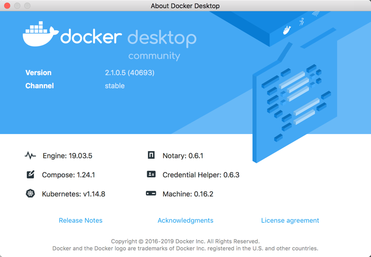

## NetDevOps
#### 2019-12-22 claudia@indigowire.net

## Ubuntu Bionic Beaver 18.04 LTS and Ansible Ansible 2.9 "Immigrant Song" Dockerfile*
 - [Latest Ubuntu 18.04 LTS (Bionic Beaver)](https://wiki.ubuntu.com/BionicBeaver/ReleaseNotes/)

 	[Ubuntu Releases](https://wiki.ubuntu.com/Releases)
 	
 	[Ansible Ubuntu Releases](https://launchpad.net/~ansible/+archive/ubuntu/ansible)

 - Python 2.7, Python 3.6, Ansible 2.9, Nornir 2.0
 - [Ansible 2.9.1 "Immigrant Song" Release Notes](https://github.com/ansible/ansible/blob/stable-2.9/changelogs/CHANGELOG-v2.9.rst)
 - Batfish and Batfish Ansible Role
 - Network Engine Role

\* if you are not sure which image to use, go with this one, Bionic Immigrant! It's the most mature, based on Ubuntu Long Term Support (LTS),  supports the automated Documentation examples you may have seen, and includes the [Batfish](https://www.batfish.org/) client, [Batfish Ansible module/role](https://www.intentionet.com/blog/announcing-batfish-ansible/),  and [Ansible Network Engine role](https://www.ansible.com/introducing-ansible-network-engine-role).  It is also the image that will run all of my shared repositories.


[cldeluna/bionic-immigrant image](https://hub.docker.com/r/cldeluna/bionic-immigrant) 

------


Purpose built Ansible image starting with Ubuntu:18.04 **Long Term Support** (LTS) Bionic Beaver base and including:
- Python 2.7 (Legacy)
- Python 3.6 and IPython
- ansible 2.9.2
- git
- tree
- nano
- wget
- vim
- traceroute
- iputils-ping
- snmp
- snmp-mibs-downloader
- yaml
- jinja2
- httplib


Python Modules:
- argparse 
- requests
- nornir
- textfms (on Python2 and Python3)
- openpyxl
- ciscoconfparse
- netmiko
- pandas
- PyYAML
- pyang
- Pillow
- pysnmp
- ncclient
- xlrd
- virtualenv
- batfish
- genie
- pyats


Repositories:
- https://github.com/cldeluna/cisco_aci.git
- https://github.com/cldeluna/cisco_ios.git

Ansible Galaxy Roles
- Batfish
- Network Engine


## Getting Started with the Docker Container (the running version of this Docker image)

A few tips to get you started quickly with the Docker container.

[Using Docker Cheatsheet](https://github.com/cldeluna/cosmic-heartbreaker/blob/master/UsingDocker_Cheatsheet.md)


## Build

```
Claudias-iMac:bionic-immigrant claudia$ tree
.
├── AboutDocker.png
├── About_iMac.png
├── Dockerfile
└── README.md

0 directories, 4 files
```

```
Claudias-iMac:bionic-immigrant claudia$ docker build -t cldeluna/bionic-immigrant .
```

## Run

Run interactively

```
Claudias-iMac:bionic-immigrant claudia$ docker run -it cldeluna/bionic-immigrant
```


Run interactively and map a local directory /Users/claudia/Documents/docker_volume to the /ansible directory in the container.
```
Claudias-iMac:bionic-immigrant claudia$ docker run -v  /Users/claudia/Documents/docker_volume:/ansible -it cldeluna/bionic-immigrant
```

Check versions and modules in container 

```bash
Claudias-iMac:bionic-immigrant claudia$
Claudias-iMac:bionic-immigrant claudia$ docker run -it cldeluna/bionic-immigrant
root@110e1cf9a2bd:/ansible_local# python --version
Python 2.7.17
root@110e1cf9a2bd:/ansible_local# python3 --version
Python 3.6.9
root@110e1cf9a2bd:/ansible_local# ansible --version
ansible 2.9.2
  config file = /etc/ansible/ansible.cfg
  configured module search path = [u'/root/.ansible/plugins/modules', u'/usr/share/ansible/plugins/modules']
  ansible python module location = /usr/lib/python2.7/dist-packages/ansible
  executable location = /usr/bin/ansible
  python version = 2.7.17 (default, Nov  7 2019, 10:07:09) [GCC 7.4.0]
root@110e1cf9a2bd:/ansible_local# pip3 freeze
aiohttp==3.6.2
arrow==0.15.4
asn1crypto==0.24.0
async-timeout==3.0.1
attrs==19.3.0
backcall==0.1.0
backports.ssl==0.0.9
bcrypt==3.1.7
bidict==0.18.3
binaryornot==0.4.4
certifi==2019.11.28
cffi==1.13.2
chardet==3.0.4
ciscoconfparse==1.4.11
Click==7.0
colorama==0.4.3
ConfigArgParse==0.15.2
cookiecutter==1.7.0
cryptography==2.8
dataclasses==0.7
decorator==4.4.1
deepdiff==4.0.9
Deprecated==1.2.7
dill==0.3.1.1
distro==1.4.0
dnspython==1.16.0
et-xmlfile==1.0.1
future==0.18.2
genie==19.12
genie.abstract==19.12
genie.conf==19.12
genie.harness==19.12
genie.libs.conf==19.12
genie.libs.filetransferutils==19.12
genie.libs.ops==19.12
genie.libs.parser==19.12
genie.libs.robot==19.12
genie.libs.sdk==19.12
genie.libs.telemetry==19.12
genie.metaparser==19.12
genie.ops==19.12
genie.parsergen==19.12
genie.predcore==19.12
genie.telemetry==19.12
genie.trafficgen==19.12
genie.utils==19.12
httplib2==0.9.2
idna==2.6
idna-ssl==1.1.0
ipaddress==1.0.23
ipython==7.10.2
ipython-genutils==0.2.0
IxNetwork==9.0.1915.16
jdcal==1.4.1
jedi==0.15.2
Jinja2==2.10
jinja2-time==0.2.0
jsonpickle==1.2
junit-xml==1.8
junos-eznc==2.3.1
keyring==10.6.0
keyrings.alt==3.0
lxml==4.4.2
MarkupSafe==1.0
multidict==4.7.2
mypy-extensions==0.4.3
napalm==2.5.0
ncclient==0.6.7
netaddr==0.7.19
netconan==0.11.0
netmiko==2.4.2
nornir==2.3.0
numpy==1.18.0
nxapi-plumbing==0.5.2
openpyxl==3.0.2
ordered-set==3.1.1
pandas==0.25.3
paramiko==2.7.1
parso==0.5.2
passlib==1.7.2
pathspec==0.7.0
pexpect==4.7.0
pickleshare==0.7.5
Pillow==6.2.1
ply==3.11
poyo==0.5.0
prettytable==0.7.2
prompt-toolkit==3.0.2
psutil==5.6.7
ptyprocess==0.6.0
pyang==2.1
pyasn1==0.4.8
pyats==19.12
pyats.aereport==19.12
pyats.aetest==19.12
pyats.async==19.12
pyats.connections==19.12
pyats.datastructures==19.12
pyats.easypy==19.12
pyats.kleenex==19.12
pyats.log==19.12
pyats.reporter==19.12
pyats.results==19.12
pyats.robot==19.12
pyats.tcl==19.12
pyats.topology==19.12
pyats.utils==19.12
pybatfish==0.36.0
pycparser==2.19
pycrypto==2.6.1
pycryptodomex==3.9.4
pydantic==0.18.2
pyeapi==0.8.2
Pygments==2.5.2
pygobject==3.26.1
pyIOSXR==0.53
PyNaCl==1.3.0
pyOpenSSL==19.1.0
pyparsing==2.4.6
pyserial==3.4
pysmi==0.3.4
pysnmp==4.4.12
python-apt==1.6.4
python-dateutil==2.8.1
pytz==2019.3
pyxdg==0.25
PyYAML==3.12
regex==2019.6.8
requests==2.22.0
requests-toolbelt==0.9.1
robotframework==3.1.2
ruamel.yaml==0.15.100
scp==0.13.2
SecretStorage==2.3.1
simplejson==3.17.0
six==1.11.0
textfsm==1.1.0
tqdm==4.41.0
traitlets==4.3.3
transitions==0.7.1
typing-extensions==3.7.4.1
unattended-upgrades==0.1
unicon==19.12
unicon.plugins==19.12.1
urllib3==1.25.7
virtualenv==16.7.9
wcwidth==0.1.7
websocket-client==0.57.0
whichcraft==0.6.1
wrapt==1.11.2
xlrd==1.2.0
XlsxWriter==1.2.7
xlwt==1.3.0
xmltodict==0.12.0
yamllint==1.20.0
yamlordereddictloader==0.4.0
yarl==1.4.2
root@110e1cf9a2bd:/ansible_local# ping 8.8.8.8
PING 8.8.8.8 (8.8.8.8) 56(84) bytes of data.
64 bytes from 8.8.8.8: icmp_seq=1 ttl=37 time=11.0 ms
64 bytes from 8.8.8.8: icmp_seq=2 ttl=37 time=10.3 ms
64 bytes from 8.8.8.8: icmp_seq=3 ttl=37 time=9.65 ms
^C
--- 8.8.8.8 ping statistics ---
3 packets transmitted, 3 received, 0% packet loss, time 2003ms
rtt min/avg/max/mdev = 9.652/10.357/11.044/0.580 ms
root@110e1cf9a2bd:/ansible_local# ls
ansible2_4_base  cisco_aci  cisco_ios
root@110e1cf9a2bd:/ansible_local# cd cisco_ios
root@110e1cf9a2bd:/ansible_local/cisco_ios# git pull
Already up to date.
root@110e1cf9a2bd:/ansible_local/cisco_ios# ls
ansible.cfg          ios_facts_lab.yml         ios_show_lab_brief.yml
filter_plugins       ios_facts_report.yml      logs
get_vrfs.yml         ios_show_cmdlist.yml      parsers
group_vars           ios_show_cmdlist_zip.yml  templates
hosts                ios_show_lab.yml
ios_all_vrf_arp.yml  ios_show_lab25.yml
root@110e1cf9a2bd:/ansible_local/cisco_ios# ansible-playbook -i hosts ios_show_lab_brief.yml

PLAY [Pull show commands form Cisco IOS_XE Always On Sandbox device] ***********

TASK [Iterate over show commands] **********************************************
ok: [ios-xe-mgmt.cisco.com] => (item=show run)
ok: [ios-xe-mgmt.cisco.com] => (item=show version)
ok: [ios-xe-mgmt.cisco.com] => (item=show inventory)
ok: [ios-xe-mgmt.cisco.com] => (item=show ip int br)
ok: [ios-xe-mgmt.cisco.com] => (item=show ip route)

TASK [debug] *******************************************************************
ok: [ios-xe-mgmt.cisco.com] => {
    "output": {
        "changed": false,
        "msg": "All items completed",
        "results": [
            {
                "ansible_loop_var": "item",
                "changed": false,
                "failed": false,
                "invocation": {
                    "module_args": {
                        "auth_pass": null,
                        "authorize": null,
                        "commands": [
                            "show run"
                        ],
                        "host": null,
                        "interval": 1,
                        "match": "all",
                        "password": null,
                        "port": null,
                        "provider": null,
                        "retries": 10,
                        "ssh_keyfile": null,
                        "timeout": null,
                        "username": null,
                        "wait_for": null
                    }
                },
                "item": "show run",
                "stdout": [
                    "Building configuration...\n\nCurrent configuration : 10515 bytes\n!\n! Last configuration change at 17:50:18 UTC Fri Dec 27 2019 by root\n!\nversion 16.9\nservice timestamps debug datetime msec\nservice timestamps log datetime msec\nplatform qfp utilization monitor load 80\nno platform punt-keepalive disable-kernel-core\nplatform console virtual\n!\nhostname csr1000v\n!\nboot-start-marker\nboot-end-marker\n!\n!\nvrf definition TEST1\n !\n address-family ipv4\n exit-address-family\n!\nvrf definition TEST2\n !\n address-family ipv4\n exit-address-family\n!\nno logging console\nenable secret 5 $1$gkJ1$EofN9ajW9k18SoRTgkhYr/\n!\nno aaa new-model\n!\n!\n!\n!\n!\n!\nip nbar http-services\n!\n!\n!\nip domain name abc.inc\n!\n!\n!\nlogin on-success log\n!\n!\n!\n!\n!\n!\n!\nsubscriber templating\n! \n! \n! \n! \n!\nipv6 unicast-routing\nmultilink bundle-name authenticated\n!\n!\n!\n!\n!\ncrypto pki trustpoint TP-self-signed-1530096085\n enrollment selfsigned\n subject-name cn=IOS-Self-Signed-Certificate-1530096085\n revocation-check none\n rsakeypair TP-self-signed-1530096085\n!\n!\ncrypto pki certificate chain TP-self-signed-1530096085\n certificate self-signed 01\n  30820330 30820218 A0030201 02020101 300D0609 2A864886 F70D0101 05050030 \n  31312F30 2D060355 04031326 494F532D 53656C66 2D536967 6E65642D 43657274 \n  69666963 6174652D 31353330 30393630 3835301E 170D3139 30353135 31353230 \n  34305A17 0D333030 31303130 30303030 305A3031 312F302D 06035504 03132649 \n  4F532D53 656C662D 5369676E 65642D43 65727469 66696361 74652D31 35333030 \n  39363038 35308201 22300D06 092A8648 86F70D01 01010500 0382010F 00308201 \n  0A028201 0100B239 1ADC578A 8FD99454 BC1BE3E4 38E9CF35 D1D2420E 53D62D27 \n  92220CF4 A1AD3126 76B809F0 F227D539 3E371330 8C7767EA 2F22A811 7CA7B88F \n  26EE73B8 9925DAFF E2453823 BCF29423 DACB3CE9 92238E44 18E1834F A6D8ABCA \n  C6B686E5 ACD87A90 AF9EAE89 093BBEDC 1E2E2AEE 989C4B8C 7D53DBE4 57AE8D66 \n  2424721F 3C66A5AC 24A77372 EC6691CE 61B8DF71 A327F668 A9C76D2D EE364206 \n  2713286B 7127CB29 57010489 D350BC1B E19C548E D63B0609 3FB63FFE DAD9CBAE \n  26A60DB8 A2C51F1D B75577DF 4CA4879C A36E545F C221760D E1308E74 35399E91 \n  8A7075CD 498E7439 BBFC72A7 9217389D 8C1787FF 5AC1ECCA 36D9AE5C 8564AD06 \n  4CD176B2 EB690203 010001A3 53305130 0F060355 1D130101 FF040530 030101FF \n  301F0603 551D2304 18301680 142A4179 9A2DB89D 21F5780E A6170B83 D01CF664 \n  17301D06 03551D0E 04160414 2A41799A 2DB89D21 F5780EA6 170B83D0 1CF66417 \n  300D0609 2A864886 F70D0101 05050003 82010100 5469C02A ACD746F5 FAA7ADD6 \n  53BF195C B0FE9815 EC401671 0FDB9C8A 91571EA0 0F1748BA BA7DEFEE 41889B7B \n  58F280B7 6FD9D433 B53E5EA4 860014A6 01408E1C 12212B34 499CFC91 9AD075B8 \n  7300AF75 A836A2A4 588B4B91 2E72DF0D DA9EA3CD 7CE8D3E3 4990A6D5 5F46634A \n  5518C7C1 34B5B5D7 44EAF2A8 0DFB4762 4F2450BE D3D0D5E3 F026015D DFF04762 \n  AA3E3332 07FEF910 D895D4D8 D673E2DB D7534719 F86C0BA8 ACAB3057 6E50A289 \n  4D1EB2F9 9D24EA20 B0ADA198 037450F4 C606864A A6C7C060 5099D394 FF68F570 \n  4D9F84E6 2B1238B9 32D7FABB F9632EA7 BA8597E8 63802AD9 B92187DF 53935107 \n  5B6C962B 805A8031 F268C32C B1338EAB 3E9A2958\n  \tquit\n!\n!\n!\n!\n!\n!\n!\n!\nlicense udi pid CSR1000V sn 9FMKNB27GMD\nlicense boot level ax\nno license smart enable\ndiagnostic bootup level minimal\n!\nspanning-tree extend system-id\n!\nnetconf-yang\n!\nrestconf\n!\nusername developer privilege 15 secret 5 $1$HtLC$7Kj3hGBoDnSHzdEeR/2ix.\nusername cisco privilege 15 secret 5 $1$aO1Y$0AFVz00ON.hE4WkY.BeYq.\nusername root privilege 15 secret 5 $1$vpY7$mh9d69ui3koSaITBi8k9D/\n!\nredundancy\n!\n!\n!\n!\n!\n!\n!\nclass-map match-all WEBUI-MULTIMEDIA_CONFERENCING-DSCP\n match dscp af41 \nclass-map match-all WEBUI-BROADCAST_VIDEO-NBAR\n match protocol attribute traffic-class broadcast-video\n match protocol attribute business-relevance business-relevant\nclass-map match-all WEBUI-VOICE-NBAR\n match protocol attribute traffic-class voip-telephony\n match protocol attribute business-relevance business-relevant\nclass-map match-all WEBUI-BULK_DATA-NBAR\n match protocol attribute traffic-class bulk-data\n match protocol attribute business-relevance business-relevant\nclass-map match-all WEBUI-SIGNALING-NBAR\n match protocol attribute traffic-class signaling\n match protocol attribute business-relevance business-relevant\nclass-map match-all WEBUI-NETWORK_CONTROL-DSCP\n match dscp cs6 \nclass-map match-all WEBUI-SCAVENGER-NBAR\n match protocol attribute business-relevance business-irrelevant\nclass-map match-all WEBUI-SCAVENGER-DSCP\n match dscp cs1 \nclass-map match-all WEBUI-NETWORK_CONTROL-NBAR\n match protocol attribute traffic-class network-control\n match protocol attribute business-relevance business-relevant\nclass-map match-all WEBUI-SIGNALING-DSCP\n match dscp cs3 \nclass-map match-all WEBUI-BULK_DATA-DSCP\n match dscp af11 \nclass-map match-all WEBUI-BROADCAST_VIDEO-DSCP\n match dscp cs5 \nclass-map match-all WEBUI-MULTIMEDIA_CONFERENCING-NBAR\n match protocol attribute traffic-class multimedia-conferencing\n match protocol attribute business-relevance business-relevant\nclass-map match-all WEBUI-VOICE-DSCP\n match dscp ef \nclass-map match-all WEBUI-NETWORK_MANAGEMENT-NBAR\n match protocol attribute traffic-class ops-admin-mgmt\n match protocol attribute business-relevance business-relevant\nclass-map match-all WEBUI-MULTIMEDIA_STREAMING-DSCP\n match dscp af31 \nclass-map match-all WEBUI-REALTIME_INTERACTIVE-NBAR\n match protocol attribute traffic-class real-time-interactive\n match protocol attribute business-relevance business-relevant\nclass-map match-all WEBUI-TRANSACTIONAL_DATA-DSCP\n match dscp af21 \nclass-map match-all WEBUI-REALTIME_INTERACTIVE-DSCP\n match dscp cs4 \nclass-map match-all WEBUI-TRANSACTIONAL_DATA-NBAR\n match protocol attribute traffic-class transactional-data\n match protocol attribute business-relevance business-relevant\nclass-map match-all WEBUI-NETWORK_MANAGEMENT-DSCP\n match dscp cs2 \nclass-map match-all WEBUI-MULTIMEDIA_STREAMING-NBAR\n match protocol attribute traffic-class multimedia-streaming\n match protocol attribute business-relevance business-relevant\n!\npolicy-map WEBUI-MARKING-IN\n class WEBUI-VOICE-NBAR\n  set dscp ef\n class WEBUI-BROADCAST_VIDEO-NBAR\n  set dscp cs5\n class WEBUI-REALTIME_INTERACTIVE-NBAR\n  set dscp cs4\n class WEBUI-MULTIMEDIA_CONFERENCING-NBAR\n  set dscp af41\n class WEBUI-MULTIMEDIA_STREAMING-NBAR\n  set dscp af31\n class WEBUI-SIGNALING-NBAR\n  set dscp cs3\n class WEBUI-NETWORK_CONTROL-NBAR\n  set dscp cs6\n class WEBUI-NETWORK_MANAGEMENT-NBAR\n  set dscp cs2\n class WEBUI-TRANSACTIONAL_DATA-NBAR\n  set dscp af21\n class WEBUI-BULK_DATA-NBAR\n  set dscp af11\n class WEBUI-SCAVENGER-NBAR\n  set dscp cs1\n class class-default\n  set dscp default\npolicy-map WEBUI-QUEUING-OUT\n class WEBUI-VOICE-DSCP\n  priority percent 10\n class WEBUI-BROADCAST_VIDEO-DSCP\n  priority percent 10\n class WEBUI-REALTIME_INTERACTIVE-DSCP\n  priority percent 13\n class WEBUI-NETWORK_CONTROL-DSCP\n  bandwidth percent 2 \n class WEBUI-SIGNALING-DSCP\n  bandwidth percent 2 \n class WEBUI-NETWORK_MANAGEMENT-DSCP\n  bandwidth percent 3 \n class WEBUI-MULTIMEDIA_CONFERENCING-DSCP\n  bandwidth percent 10 \n  fair-queue\n  random-detect dscp-based\n class WEBUI-MULTIMEDIA_STREAMING-DSCP\n  bandwidth percent 10 \n  fair-queue\n  random-detect dscp-based\n class WEBUI-TRANSACTIONAL_DATA-DSCP\n  bandwidth percent 10 \n  fair-queue\n  random-detect dscp-based\n class WEBUI-BULK_DATA-DSCP\n  bandwidth percent 4 \n  fair-queue\n  random-detect dscp-based\n class WEBUI-SCAVENGER-DSCP\n  bandwidth percent 1 \n class class-default\n  bandwidth percent 25 \n  fair-queue\n  random-detect dscp-based\n!\n! \n!\n!\n!\n!\n!\n!\n!\n!\n!\n!\n!\n!\n! \n! \n!\n!\ninterface Loopback31\n no ip address\n ipv6 enable\n!\ninterface Loopback103\n description Demo interface by CLI and netmiko\n ip address 192.168.103.1 255.255.255.0\n!\ninterface Loopback198\n description Imre Loopback\n ip address 123.123.13.13 255.255.255.255\n!\ninterface Loopback199\n description Lacika' loopback\n ip address 222.111.222.111 255.255.255.0\n!\ninterface Loopback305\n description zyang\n ip address 40.40.40.1 255.255.255.0 secondary\n ip address 50.50.50.1 255.255.255.0 secondary\n ip address 30.30.30.1 255.255.255.0\n!\ninterface Loopback345\n description Tamas' loopback\n ip address 123.123.123.99 255.255.255.0\n!\ninterface Loopback445\n description Zoli2' loopback\n ip address 13.12.11.99 255.255.255.0\n!\ninterface Loopback524\n description Zoli interface\n ip address 192.168.168.5 255.255.255.255\n!\ninterface Loopback567\n description Gyuri' loopback\n ip address 12.12.12.12 255.255.255.0\n!\ninterface Loopback898\n description Sandor' loopback\n ip address 123.113.113.88 255.255.255.0\n!\ninterface Loopback985\n description Configured by RESTCONF\n ip address 200.200.200.200 255.255.255.0\n!\ninterface Loopback1001\n vrf forwarding TEST1\n ip address 1.0.0.1 255.255.255.0\n!\ninterface Loopback1002\n vrf forwarding TEST2\n ip address 1.0.0.2 255.255.255.255\n!\ninterface Loopback5000\n no ip address\n!\ninterface Loopback5001\n no ip address\n!\ninterface Loopback6789\n description Testoop\n ip address 67.89.67.89 255.255.255.255\n!\ninterface Loopback7867\n description gkundrak\n ip address 78.6.76.67 255.255.255.255\n!\ninterface Loopback33610\n no ip address\n!\ninterface VirtualPortGroup0\n ip address 192.168.1.1 255.255.255.0\n no mop enabled\n no mop sysid\n!\ninterface GigabitEthernet1\n description MANAGEMENT INTERFACE - DON'T TOUCH ME\n ip address 10.10.20.48 255.255.255.0\n ip nbar protocol-discovery\n negotiation auto\n no mop enabled\n no mop sysid\n service-policy input WEBUI-MARKING-IN\n service-policy output WEBUI-QUEUING-OUT\n!\ninterface GigabitEthernet2\n description Configured by RESTCONF\n ip address 172.16.255.1 255.255.255.0 secondary\n ip address 10.255.255.1 255.255.255.0\n negotiation auto\n no mop enabled\n no mop sysid\n!\ninterface GigabitEthernet3\n description Configured by NETCONF\n no ip address\n negotiation auto\n no mop enabled\n no mop sysid\n!\niox\nip nat inside source static 10.4.4.4 172.44.44.44\nip forward-protocol nd\nip http server\nip http authentication local\nip http secure-server\nip route 0.0.0.0 0.0.0.0 GigabitEthernet1 10.10.20.254\n!\nip ssh rsa keypair-name ssh-key\nip ssh version 2\nip scp server enable\n!\n!\n!\n!\n!\ncontrol-plane\n!\n!\n!\n!\n!\nbanner motd ^C\nWelcome to the DevNet Sandbox for CSR1000v and IOS XE\n\nThe following programmability features are already enabled:\n  - NETCONF\n  - RESTCONF\n\nThanks for stopping by.\n^C\n!\nline con 0\n exec-timeout 0 0\n stopbits 1\nline vty 0 4\n login local\n transport input ssh\n!\nntp server 10.11.15.65\nntp server 10.12.15.65\nntp server 10.13.15.65\nntp server 10.14.15.65\n!\n!\n!\n!\n!\n!\napp-hosting appid guestshell\n app-vnic gateway0 virtualportgroup 0 guest-interface 0\n  guest-ipaddress 192.168.1.2 netmask 255.255.255.0\n name-server0 8.8.8.8\nend"
                ],
                "stdout_lines": [
                    [
                        "Building configuration...",
                        "",
                        "Current configuration : 10515 bytes",
                        "!",
                        "! Last configuration change at 17:50:18 UTC Fri Dec 27 2019 by root",
                        "!",
                        "version 16.9",
                        "service timestamps debug datetime msec",
                        "service timestamps log datetime msec",
                        "platform qfp utilization monitor load 80",
                        "no platform punt-keepalive disable-kernel-core",
                        "platform console virtual",
                        "!",
                        "hostname csr1000v",
                        "!",
                        "boot-start-marker",
                        "boot-end-marker",
                        "!",
                        "!",
                        "vrf definition TEST1",
                        " !",
                        " address-family ipv4",
                        " exit-address-family",
                        "!",
                        "vrf definition TEST2",
                        " !",
                        " address-family ipv4",
                        " exit-address-family",
                        "!",
                        "no logging console",
                        "enable secret 5 $1$gkJ1$EofN9ajW9k18SoRTgkhYr/",
                        "!",
                        "no aaa new-model",
                        "!",
                        "!",
                        "!",
                        "!",
                        "!",
                        "!",
                        "ip nbar http-services",
                        "!",
                        "!",
                        "!",
                        "ip domain name abc.inc",
                        "!",
                        "!",
                        "!",
                        "login on-success log",
                        "!",
                        "!",
                        "!",
                        "!",
                        "!",
                        "!",
                        "!",
                        "subscriber templating",
                        "! ",
                        "! ",
                        "! ",
                        "! ",
                        "!",
                        "ipv6 unicast-routing",
                        "multilink bundle-name authenticated",
                        "!",
                        "!",
                        "!",
                        "!",
                        "!",
                        "crypto pki trustpoint TP-self-signed-1530096085",
                        " enrollment selfsigned",
                        " subject-name cn=IOS-Self-Signed-Certificate-1530096085",
                        " revocation-check none",
                        " rsakeypair TP-self-signed-1530096085",
                        "!",
                        "!",
                        "crypto pki certificate chain TP-self-signed-1530096085",
                        " certificate self-signed 01",
                        "  30820330 30820218 A0030201 02020101 300D0609 2A864886 F70D0101 05050030 ",
                        "  31312F30 2D060355 04031326 494F532D 53656C66 2D536967 6E65642D 43657274 ",
                        "  69666963 6174652D 31353330 30393630 3835301E 170D3139 30353135 31353230 ",
                        "  34305A17 0D333030 31303130 30303030 305A3031 312F302D 06035504 03132649 ",
                        "  4F532D53 656C662D 5369676E 65642D43 65727469 66696361 74652D31 35333030 ",
                        "  39363038 35308201 22300D06 092A8648 86F70D01 01010500 0382010F 00308201 ",
                        "  0A028201 0100B239 1ADC578A 8FD99454 BC1BE3E4 38E9CF35 D1D2420E 53D62D27 ",
                        "  92220CF4 A1AD3126 76B809F0 F227D539 3E371330 8C7767EA 2F22A811 7CA7B88F ",
                        "  26EE73B8 9925DAFF E2453823 BCF29423 DACB3CE9 92238E44 18E1834F A6D8ABCA ",
                        "  C6B686E5 ACD87A90 AF9EAE89 093BBEDC 1E2E2AEE 989C4B8C 7D53DBE4 57AE8D66 ",
                        "  2424721F 3C66A5AC 24A77372 EC6691CE 61B8DF71 A327F668 A9C76D2D EE364206 ",
                        "  2713286B 7127CB29 57010489 D350BC1B E19C548E D63B0609 3FB63FFE DAD9CBAE ",
                        "  26A60DB8 A2C51F1D B75577DF 4CA4879C A36E545F C221760D E1308E74 35399E91 ",
                        "  8A7075CD 498E7439 BBFC72A7 9217389D 8C1787FF 5AC1ECCA 36D9AE5C 8564AD06 ",
                        "  4CD176B2 EB690203 010001A3 53305130 0F060355 1D130101 FF040530 030101FF ",
                        "  301F0603 551D2304 18301680 142A4179 9A2DB89D 21F5780E A6170B83 D01CF664 ",
                        "  17301D06 03551D0E 04160414 2A41799A 2DB89D21 F5780EA6 170B83D0 1CF66417 ",
                        "  300D0609 2A864886 F70D0101 05050003 82010100 5469C02A ACD746F5 FAA7ADD6 ",
                        "  53BF195C B0FE9815 EC401671 0FDB9C8A 91571EA0 0F1748BA BA7DEFEE 41889B7B ",
                        "  58F280B7 6FD9D433 B53E5EA4 860014A6 01408E1C 12212B34 499CFC91 9AD075B8 ",
                        "  7300AF75 A836A2A4 588B4B91 2E72DF0D DA9EA3CD 7CE8D3E3 4990A6D5 5F46634A ",
                        "  5518C7C1 34B5B5D7 44EAF2A8 0DFB4762 4F2450BE D3D0D5E3 F026015D DFF04762 ",
                        "  AA3E3332 07FEF910 D895D4D8 D673E2DB D7534719 F86C0BA8 ACAB3057 6E50A289 ",
                        "  4D1EB2F9 9D24EA20 B0ADA198 037450F4 C606864A A6C7C060 5099D394 FF68F570 ",
                        "  4D9F84E6 2B1238B9 32D7FABB F9632EA7 BA8597E8 63802AD9 B92187DF 53935107 ",
                        "  5B6C962B 805A8031 F268C32C B1338EAB 3E9A2958",
                        "  \tquit",
                        "!",
                        "!",
                        "!",
                        "!",
                        "!",
                        "!",
                        "!",
                        "!",
                        "license udi pid CSR1000V sn 9FMKNB27GMD",
                        "license boot level ax",
                        "no license smart enable",
                        "diagnostic bootup level minimal",
                        "!",
                        "spanning-tree extend system-id",
                        "!",
                        "netconf-yang",
                        "!",
                        "restconf",
                        "!",
                        "username developer privilege 15 secret 5 $1$HtLC$7Kj3hGBoDnSHzdEeR/2ix.",
                        "username cisco privilege 15 secret 5 $1$aO1Y$0AFVz00ON.hE4WkY.BeYq.",
                        "username root privilege 15 secret 5 $1$vpY7$mh9d69ui3koSaITBi8k9D/",
                        "!",
                        "redundancy",
                        "!",
                        "!",
                        "!",
                        "!",
                        "!",
                        "!",
                        "!",
                        "class-map match-all WEBUI-MULTIMEDIA_CONFERENCING-DSCP",
                        " match dscp af41 ",
                        "class-map match-all WEBUI-BROADCAST_VIDEO-NBAR",
                        " match protocol attribute traffic-class broadcast-video",
                        " match protocol attribute business-relevance business-relevant",
                        "class-map match-all WEBUI-VOICE-NBAR",
                        " match protocol attribute traffic-class voip-telephony",
                        " match protocol attribute business-relevance business-relevant",
                        "class-map match-all WEBUI-BULK_DATA-NBAR",
                        " match protocol attribute traffic-class bulk-data",
                        " match protocol attribute business-relevance business-relevant",
                        "class-map match-all WEBUI-SIGNALING-NBAR",
                        " match protocol attribute traffic-class signaling",
                        " match protocol attribute business-relevance business-relevant",
                        "class-map match-all WEBUI-NETWORK_CONTROL-DSCP",
                        " match dscp cs6 ",
                        "class-map match-all WEBUI-SCAVENGER-NBAR",
                        " match protocol attribute business-relevance business-irrelevant",
                        "class-map match-all WEBUI-SCAVENGER-DSCP",
                        " match dscp cs1 ",
                        "class-map match-all WEBUI-NETWORK_CONTROL-NBAR",
                        " match protocol attribute traffic-class network-control",
                        " match protocol attribute business-relevance business-relevant",
                        "class-map match-all WEBUI-SIGNALING-DSCP",
                        " match dscp cs3 ",
                        "class-map match-all WEBUI-BULK_DATA-DSCP",
                        " match dscp af11 ",
                        "class-map match-all WEBUI-BROADCAST_VIDEO-DSCP",
                        " match dscp cs5 ",
                        "class-map match-all WEBUI-MULTIMEDIA_CONFERENCING-NBAR",
                        " match protocol attribute traffic-class multimedia-conferencing",
                        " match protocol attribute business-relevance business-relevant",
                        "class-map match-all WEBUI-VOICE-DSCP",
                        " match dscp ef ",
                        "class-map match-all WEBUI-NETWORK_MANAGEMENT-NBAR",
                        " match protocol attribute traffic-class ops-admin-mgmt",
                        " match protocol attribute business-relevance business-relevant",
                        "class-map match-all WEBUI-MULTIMEDIA_STREAMING-DSCP",
                        " match dscp af31 ",
                        "class-map match-all WEBUI-REALTIME_INTERACTIVE-NBAR",
                        " match protocol attribute traffic-class real-time-interactive",
                        " match protocol attribute business-relevance business-relevant",
                        "class-map match-all WEBUI-TRANSACTIONAL_DATA-DSCP",
                        " match dscp af21 ",
                        "class-map match-all WEBUI-REALTIME_INTERACTIVE-DSCP",
                        " match dscp cs4 ",
                        "class-map match-all WEBUI-TRANSACTIONAL_DATA-NBAR",
                        " match protocol attribute traffic-class transactional-data",
                        " match protocol attribute business-relevance business-relevant",
                        "class-map match-all WEBUI-NETWORK_MANAGEMENT-DSCP",
                        " match dscp cs2 ",
                        "class-map match-all WEBUI-MULTIMEDIA_STREAMING-NBAR",
                        " match protocol attribute traffic-class multimedia-streaming",
                        " match protocol attribute business-relevance business-relevant",
                        "!",
                        "policy-map WEBUI-MARKING-IN",
                        " class WEBUI-VOICE-NBAR",
                        "  set dscp ef",
                        " class WEBUI-BROADCAST_VIDEO-NBAR",
                        "  set dscp cs5",
                        " class WEBUI-REALTIME_INTERACTIVE-NBAR",
                        "  set dscp cs4",
                        " class WEBUI-MULTIMEDIA_CONFERENCING-NBAR",
                        "  set dscp af41",
                        " class WEBUI-MULTIMEDIA_STREAMING-NBAR",
                        "  set dscp af31",
                        " class WEBUI-SIGNALING-NBAR",
                        "  set dscp cs3",
                        " class WEBUI-NETWORK_CONTROL-NBAR",
                        "  set dscp cs6",
                        " class WEBUI-NETWORK_MANAGEMENT-NBAR",
                        "  set dscp cs2",
                        " class WEBUI-TRANSACTIONAL_DATA-NBAR",
                        "  set dscp af21",
                        " class WEBUI-BULK_DATA-NBAR",
                        "  set dscp af11",
                        " class WEBUI-SCAVENGER-NBAR",
                        "  set dscp cs1",
                        " class class-default",
                        "  set dscp default",
                        "policy-map WEBUI-QUEUING-OUT",
                        " class WEBUI-VOICE-DSCP",
                        "  priority percent 10",
                        " class WEBUI-BROADCAST_VIDEO-DSCP",
                        "  priority percent 10",
                        " class WEBUI-REALTIME_INTERACTIVE-DSCP",
                        "  priority percent 13",
                        " class WEBUI-NETWORK_CONTROL-DSCP",
                        "  bandwidth percent 2 ",
                        " class WEBUI-SIGNALING-DSCP",
                        "  bandwidth percent 2 ",
                        " class WEBUI-NETWORK_MANAGEMENT-DSCP",
                        "  bandwidth percent 3 ",
                        " class WEBUI-MULTIMEDIA_CONFERENCING-DSCP",
                        "  bandwidth percent 10 ",
                        "  fair-queue",
                        "  random-detect dscp-based",
                        " class WEBUI-MULTIMEDIA_STREAMING-DSCP",
                        "  bandwidth percent 10 ",
                        "  fair-queue",
                        "  random-detect dscp-based",
                        " class WEBUI-TRANSACTIONAL_DATA-DSCP",
                        "  bandwidth percent 10 ",
                        "  fair-queue",
                        "  random-detect dscp-based",
                        " class WEBUI-BULK_DATA-DSCP",
                        "  bandwidth percent 4 ",
                        "  fair-queue",
                        "  random-detect dscp-based",
                        " class WEBUI-SCAVENGER-DSCP",
                        "  bandwidth percent 1 ",
                        " class class-default",
                        "  bandwidth percent 25 ",
                        "  fair-queue",
                        "  random-detect dscp-based",
                        "!",
                        "! ",
                        "!",
                        "!",
                        "!",
                        "!",
                        "!",
                        "!",
                        "!",
                        "!",
                        "!",
                        "!",
                        "!",
                        "!",
                        "! ",
                        "! ",
                        "!",
                        "!",
                        "interface Loopback31",
                        " no ip address",
                        " ipv6 enable",
                        "!",
                        "interface Loopback103",
                        " description Demo interface by CLI and netmiko",
                        " ip address 192.168.103.1 255.255.255.0",
                        "!",
                        "interface Loopback198",
                        " description Imre Loopback",
                        " ip address 123.123.13.13 255.255.255.255",
                        "!",
                        "interface Loopback199",
                        " description Lacika' loopback",
                        " ip address 222.111.222.111 255.255.255.0",
                        "!",
                        "interface Loopback305",
                        " description zyang",
                        " ip address 40.40.40.1 255.255.255.0 secondary",
                        " ip address 50.50.50.1 255.255.255.0 secondary",
                        " ip address 30.30.30.1 255.255.255.0",
                        "!",
                        "interface Loopback345",
                        " description Tamas' loopback",
                        " ip address 123.123.123.99 255.255.255.0",
                        "!",
                        "interface Loopback445",
                        " description Zoli2' loopback",
                        " ip address 13.12.11.99 255.255.255.0",
                        "!",
                        "interface Loopback524",
                        " description Zoli interface",
                        " ip address 192.168.168.5 255.255.255.255",
                        "!",
                        "interface Loopback567",
                        " description Gyuri' loopback",
                        " ip address 12.12.12.12 255.255.255.0",
                        "!",
                        "interface Loopback898",
                        " description Sandor' loopback",
                        " ip address 123.113.113.88 255.255.255.0",
                        "!",
                        "interface Loopback985",
                        " description Configured by RESTCONF",
                        " ip address 200.200.200.200 255.255.255.0",
                        "!",
                        "interface Loopback1001",
                        " vrf forwarding TEST1",
                        " ip address 1.0.0.1 255.255.255.0",
                        "!",
                        "interface Loopback1002",
                        " vrf forwarding TEST2",
                        " ip address 1.0.0.2 255.255.255.255",
                        "!",
                        "interface Loopback5000",
                        " no ip address",
                        "!",
                        "interface Loopback5001",
                        " no ip address",
                        "!",
                        "interface Loopback6789",
                        " description Testoop",
                        " ip address 67.89.67.89 255.255.255.255",
                        "!",
                        "interface Loopback7867",
                        " description gkundrak",
                        " ip address 78.6.76.67 255.255.255.255",
                        "!",
                        "interface Loopback33610",
                        " no ip address",
                        "!",
                        "interface VirtualPortGroup0",
                        " ip address 192.168.1.1 255.255.255.0",
                        " no mop enabled",
                        " no mop sysid",
                        "!",
                        "interface GigabitEthernet1",
                        " description MANAGEMENT INTERFACE - DON'T TOUCH ME",
                        " ip address 10.10.20.48 255.255.255.0",
                        " ip nbar protocol-discovery",
                        " negotiation auto",
                        " no mop enabled",
                        " no mop sysid",
                        " service-policy input WEBUI-MARKING-IN",
                        " service-policy output WEBUI-QUEUING-OUT",
                        "!",
                        "interface GigabitEthernet2",
                        " description Configured by RESTCONF",
                        " ip address 172.16.255.1 255.255.255.0 secondary",
                        " ip address 10.255.255.1 255.255.255.0",
                        " negotiation auto",
                        " no mop enabled",
                        " no mop sysid",
                        "!",
                        "interface GigabitEthernet3",
                        " description Configured by NETCONF",
                        " no ip address",
                        " negotiation auto",
                        " no mop enabled",
                        " no mop sysid",
                        "!",
                        "iox",
                        "ip nat inside source static 10.4.4.4 172.44.44.44",
                        "ip forward-protocol nd",
                        "ip http server",
                        "ip http authentication local",
                        "ip http secure-server",
                        "ip route 0.0.0.0 0.0.0.0 GigabitEthernet1 10.10.20.254",
                        "!",
                        "ip ssh rsa keypair-name ssh-key",
                        "ip ssh version 2",
                        "ip scp server enable",
                        "!",
                        "!",
                        "!",
                        "!",
                        "!",
                        "control-plane",
                        "!",
                        "!",
                        "!",
                        "!",
                        "!",
                        "banner motd ^C",
                        "Welcome to the DevNet Sandbox for CSR1000v and IOS XE",
                        "",
                        "The following programmability features are already enabled:",
                        "  - NETCONF",
                        "  - RESTCONF",
                        "",
                        "Thanks for stopping by.",
                        "^C",
                        "!",
                        "line con 0",
                        " exec-timeout 0 0",
                        " stopbits 1",
                        "line vty 0 4",
                        " login local",
                        " transport input ssh",
                        "!",
                        "ntp server 10.11.15.65",
                        "ntp server 10.12.15.65",
                        "ntp server 10.13.15.65",
                        "ntp server 10.14.15.65",
                        "!",
                        "!",
                        "!",
                        "!",
                        "!",
                        "!",
                        "app-hosting appid guestshell",
                        " app-vnic gateway0 virtualportgroup 0 guest-interface 0",
                        "  guest-ipaddress 192.168.1.2 netmask 255.255.255.0",
                        " name-server0 8.8.8.8",
                        "end"
                    ]
                ]
            },
            {
                "ansible_loop_var": "item",
                "changed": false,
                "failed": false,
                "invocation": {
                    "module_args": {
                        "auth_pass": null,
                        "authorize": null,
                        "commands": [
                            "show version"
                        ],
                        "host": null,
                        "interval": 1,
                        "match": "all",
                        "password": null,
                        "port": null,
                        "provider": null,
                        "retries": 10,
                        "ssh_keyfile": null,
                        "timeout": null,
                        "username": null,
                        "wait_for": null
                    }
                },
                "item": "show version",
                "stdout": [
                    "Cisco IOS XE Software, Version 16.09.03\nCisco IOS Software [Fuji], Virtual XE Software (X86_64_LINUX_IOSD-UNIVERSALK9-M), Version 16.9.3, RELEASE SOFTWARE (fc2)\nTechnical Support: http://www.cisco.com/techsupport\nCopyright (c) 1986-2019 by Cisco Systems, Inc.\nCompiled Wed 20-Mar-19 07:56 by mcpre\n\n\nCisco IOS-XE software, Copyright (c) 2005-2019 by cisco Systems, Inc.\nAll rights reserved.  Certain components of Cisco IOS-XE software are\nlicensed under the GNU General Public License (\"GPL\") Version 2.0.  The\nsoftware code licensed under GPL Version 2.0 is free software that comes\nwith ABSOLUTELY NO WARRANTY.  You can redistribute and/or modify such\nGPL code under the terms of GPL Version 2.0.  For more details, see the\ndocumentation or \"License Notice\" file accompanying the IOS-XE software,\nor the applicable URL provided on the flyer accompanying the IOS-XE\nsoftware.\n\n\nROM: IOS-XE ROMMON\n\ncsr1000v uptime is 1 week, 1 day, 4 hours, 5 minutes\nUptime for this control processor is 1 week, 1 day, 4 hours, 6 minutes\nSystem returned to ROM by reload\nSystem image file is \"bootflash:packages.conf\"\nLast reload reason: reload\n\n\n\nThis product contains cryptographic features and is subject to United\nStates and local country laws governing import, export, transfer and\nuse. Delivery of Cisco cryptographic products does not imply\nthird-party authority to import, export, distribute or use encryption.\nImporters, exporters, distributors and users are responsible for\ncompliance with U.S. and local country laws. By using this product you\nagree to comply with applicable laws and regulations. If you are unable\nto comply with U.S. and local laws, return this product immediately.\n\nA summary of U.S. laws governing Cisco cryptographic products may be found at:\nhttp://www.cisco.com/wwl/export/crypto/tool/stqrg.html\n\nIf you require further assistance please contact us by sending email to\nexport@cisco.com.\n\nLicense Level: ax\nLicense Type: Default. No valid license found.\nNext reload license Level: ax\n\n\nSmart Licensing Status: Smart Licensing is DISABLED\n\ncisco CSR1000V (VXE) processor (revision VXE) with 2392579K/3075K bytes of memory.\nProcessor board ID 9FMKNB27GMD\n3 Gigabit Ethernet interfaces\n32768K bytes of non-volatile configuration memory.\n8113280K bytes of physical memory.\n7774207K bytes of virtual hard disk at bootflash:.\n0K bytes of WebUI ODM Files at webui:.\n\nConfiguration register is 0x2102"
                ],
                "stdout_lines": [
                    [
                        "Cisco IOS XE Software, Version 16.09.03",
                        "Cisco IOS Software [Fuji], Virtual XE Software (X86_64_LINUX_IOSD-UNIVERSALK9-M), Version 16.9.3, RELEASE SOFTWARE (fc2)",
                        "Technical Support: http://www.cisco.com/techsupport",
                        "Copyright (c) 1986-2019 by Cisco Systems, Inc.",
                        "Compiled Wed 20-Mar-19 07:56 by mcpre",
                        "",
                        "",
                        "Cisco IOS-XE software, Copyright (c) 2005-2019 by cisco Systems, Inc.",
                        "All rights reserved.  Certain components of Cisco IOS-XE software are",
                        "licensed under the GNU General Public License (\"GPL\") Version 2.0.  The",
                        "software code licensed under GPL Version 2.0 is free software that comes",
                        "with ABSOLUTELY NO WARRANTY.  You can redistribute and/or modify such",
                        "GPL code under the terms of GPL Version 2.0.  For more details, see the",
                        "documentation or \"License Notice\" file accompanying the IOS-XE software,",
                        "or the applicable URL provided on the flyer accompanying the IOS-XE",
                        "software.",
                        "",
                        "",
                        "ROM: IOS-XE ROMMON",
                        "",
                        "csr1000v uptime is 1 week, 1 day, 4 hours, 5 minutes",
                        "Uptime for this control processor is 1 week, 1 day, 4 hours, 6 minutes",
                        "System returned to ROM by reload",
                        "System image file is \"bootflash:packages.conf\"",
                        "Last reload reason: reload",
                        "",
                        "",
                        "",
                        "This product contains cryptographic features and is subject to United",
                        "States and local country laws governing import, export, transfer and",
                        "use. Delivery of Cisco cryptographic products does not imply",
                        "third-party authority to import, export, distribute or use encryption.",
                        "Importers, exporters, distributors and users are responsible for",
                        "compliance with U.S. and local country laws. By using this product you",
                        "agree to comply with applicable laws and regulations. If you are unable",
                        "to comply with U.S. and local laws, return this product immediately.",
                        "",
                        "A summary of U.S. laws governing Cisco cryptographic products may be found at:",
                        "http://www.cisco.com/wwl/export/crypto/tool/stqrg.html",
                        "",
                        "If you require further assistance please contact us by sending email to",
                        "export@cisco.com.",
                        "",
                        "License Level: ax",
                        "License Type: Default. No valid license found.",
                        "Next reload license Level: ax",
                        "",
                        "",
                        "Smart Licensing Status: Smart Licensing is DISABLED",
                        "",
                        "cisco CSR1000V (VXE) processor (revision VXE) with 2392579K/3075K bytes of memory.",
                        "Processor board ID 9FMKNB27GMD",
                        "3 Gigabit Ethernet interfaces",
                        "32768K bytes of non-volatile configuration memory.",
                        "8113280K bytes of physical memory.",
                        "7774207K bytes of virtual hard disk at bootflash:.",
                        "0K bytes of WebUI ODM Files at webui:.",
                        "",
                        "Configuration register is 0x2102"
                    ]
                ]
            },
            {
                "ansible_loop_var": "item",
                "changed": false,
                "failed": false,
                "invocation": {
                    "module_args": {
                        "auth_pass": null,
                        "authorize": null,
                        "commands": [
                            "show inventory"
                        ],
                        "host": null,
                        "interval": 1,
                        "match": "all",
                        "password": null,
                        "port": null,
                        "provider": null,
                        "retries": 10,
                        "ssh_keyfile": null,
                        "timeout": null,
                        "username": null,
                        "wait_for": null
                    }
                },
                "item": "show inventory",
                "stdout": [
                    "NAME: \"Chassis\", DESCR: \"Cisco CSR1000V Chassis\"\nPID: CSR1000V          , VID: V00  , SN: 9FMKNB27GMD\n\nNAME: \"module R0\", DESCR: \"Cisco CSR1000V Route Processor\"\nPID: CSR1000V          , VID: V00  , SN: JAB1303001C\n\nNAME: \"module F0\", DESCR: \"Cisco CSR1000V Embedded Services Processor\"\nPID: CSR1000V          , VID:      , SN:"
                ],
                "stdout_lines": [
                    [
                        "NAME: \"Chassis\", DESCR: \"Cisco CSR1000V Chassis\"",
                        "PID: CSR1000V          , VID: V00  , SN: 9FMKNB27GMD",
                        "",
                        "NAME: \"module R0\", DESCR: \"Cisco CSR1000V Route Processor\"",
                        "PID: CSR1000V          , VID: V00  , SN: JAB1303001C",
                        "",
                        "NAME: \"module F0\", DESCR: \"Cisco CSR1000V Embedded Services Processor\"",
                        "PID: CSR1000V          , VID:      , SN:"
                    ]
                ]
            },
            {
                "ansible_loop_var": "item",
                "changed": false,
                "failed": false,
                "invocation": {
                    "module_args": {
                        "auth_pass": null,
                        "authorize": null,
                        "commands": [
                            "show ip int br"
                        ],
                        "host": null,
                        "interval": 1,
                        "match": "all",
                        "password": null,
                        "port": null,
                        "provider": null,
                        "retries": 10,
                        "ssh_keyfile": null,
                        "timeout": null,
                        "username": null,
                        "wait_for": null
                    }
                },
                "item": "show ip int br",
                "stdout": [
                    "Interface              IP-Address      OK? Method Status                Protocol\nGigabitEthernet1       10.10.20.48     YES NVRAM  up                    up      \nGigabitEthernet2       10.255.255.1    YES other  up                    up      \nGigabitEthernet3       unassigned      YES NVRAM  up                    up      \nLoopback31             unassigned      YES unset  up                    up      \nLoopback103            192.168.103.1   YES manual up                    up      \nLoopback198            123.123.13.13   YES other  up                    up      \nLoopback199            222.111.222.111 YES other  up                    up      \nLoopback305            30.30.30.1      YES manual up                    up      \nLoopback345            123.123.123.99  YES other  up                    up      \nLoopback445            13.12.11.99     YES other  up                    up      \nLoopback524            192.168.168.5   YES other  up                    up      \nLoopback567            12.12.12.12     YES other  up                    up      \nLoopback898            123.113.113.88  YES other  up                    up      \nLoopback985            200.200.200.200 YES other  up                    up      \nLoopback1001           1.0.0.1         YES manual up                    up      \nLoopback1002           1.0.0.2         YES manual up                    up      \nLoopback5000           unassigned      YES other  up                    up      \nLoopback5001           unassigned      YES unset  up                    up      \nLoopback6789           67.89.67.89     YES other  up                    up      \nLoopback7867           78.6.76.67      YES other  up                    up      \nLoopback33610          unassigned      YES unset  up                    up      \nVirtualPortGroup0      192.168.1.1     YES manual up                    up"
                ],
                "stdout_lines": [
                    [
                        "Interface              IP-Address      OK? Method Status                Protocol",
                        "GigabitEthernet1       10.10.20.48     YES NVRAM  up                    up      ",
                        "GigabitEthernet2       10.255.255.1    YES other  up                    up      ",
                        "GigabitEthernet3       unassigned      YES NVRAM  up                    up      ",
                        "Loopback31             unassigned      YES unset  up                    up      ",
                        "Loopback103            192.168.103.1   YES manual up                    up      ",
                        "Loopback198            123.123.13.13   YES other  up                    up      ",
                        "Loopback199            222.111.222.111 YES other  up                    up      ",
                        "Loopback305            30.30.30.1      YES manual up                    up      ",
                        "Loopback345            123.123.123.99  YES other  up                    up      ",
                        "Loopback445            13.12.11.99     YES other  up                    up      ",
                        "Loopback524            192.168.168.5   YES other  up                    up      ",
                        "Loopback567            12.12.12.12     YES other  up                    up      ",
                        "Loopback898            123.113.113.88  YES other  up                    up      ",
                        "Loopback985            200.200.200.200 YES other  up                    up      ",
                        "Loopback1001           1.0.0.1         YES manual up                    up      ",
                        "Loopback1002           1.0.0.2         YES manual up                    up      ",
                        "Loopback5000           unassigned      YES other  up                    up      ",
                        "Loopback5001           unassigned      YES unset  up                    up      ",
                        "Loopback6789           67.89.67.89     YES other  up                    up      ",
                        "Loopback7867           78.6.76.67      YES other  up                    up      ",
                        "Loopback33610          unassigned      YES unset  up                    up      ",
                        "VirtualPortGroup0      192.168.1.1     YES manual up                    up"
                    ]
                ]
            },
            {
                "ansible_loop_var": "item",
                "changed": false,
                "failed": false,
                "invocation": {
                    "module_args": {
                        "auth_pass": null,
                        "authorize": null,
                        "commands": [
                            "show ip route"
                        ],
                        "host": null,
                        "interval": 1,
                        "match": "all",
                        "password": null,
                        "port": null,
                        "provider": null,
                        "retries": 10,
                        "ssh_keyfile": null,
                        "timeout": null,
                        "username": null,
                        "wait_for": null
                    }
                },
                "item": "show ip route",
                "stdout": [
                    "Codes: L - local, C - connected, S - static, R - RIP, M - mobile, B - BGP\n       D - EIGRP, EX - EIGRP external, O - OSPF, IA - OSPF inter area \n       N1 - OSPF NSSA external type 1, N2 - OSPF NSSA external type 2\n       E1 - OSPF external type 1, E2 - OSPF external type 2\n       i - IS-IS, su - IS-IS summary, L1 - IS-IS level-1, L2 - IS-IS level-2\n       ia - IS-IS inter area, * - candidate default, U - per-user static route\n       o - ODR, P - periodic downloaded static route, H - NHRP, l - LISP\n       a - application route\n       + - replicated route, % - next hop override, p - overrides from PfR\n\nGateway of last resort is 10.10.20.254 to network 0.0.0.0\n\nS*    0.0.0.0/0 [1/0] via 10.10.20.254, GigabitEthernet1\n      10.0.0.0/8 is variably subnetted, 4 subnets, 2 masks\nC        10.10.20.0/24 is directly connected, GigabitEthernet1\nL        10.10.20.48/32 is directly connected, GigabitEthernet1\nC        10.255.255.0/24 is directly connected, GigabitEthernet2\nL        10.255.255.1/32 is directly connected, GigabitEthernet2\n      12.0.0.0/8 is variably subnetted, 2 subnets, 2 masks\nC        12.12.12.0/24 is directly connected, Loopback567\nL        12.12.12.12/32 is directly connected, Loopback567\n      13.0.0.0/8 is variably subnetted, 2 subnets, 2 masks\nC        13.12.11.0/24 is directly connected, Loopback445\nL        13.12.11.99/32 is directly connected, Loopback445\n      30.0.0.0/8 is variably subnetted, 2 subnets, 2 masks\nC        30.30.30.0/24 is directly connected, Loopback305\nL        30.30.30.1/32 is directly connected, Loopback305\n      40.0.0.0/8 is variably subnetted, 2 subnets, 2 masks\nC        40.40.40.0/24 is directly connected, Loopback305\nL        40.40.40.1/32 is directly connected, Loopback305\n      50.0.0.0/8 is variably subnetted, 2 subnets, 2 masks\nC        50.50.50.0/24 is directly connected, Loopback305\nL        50.50.50.1/32 is directly connected, Loopback305\n      67.0.0.0/32 is subnetted, 1 subnets\nC        67.89.67.89 is directly connected, Loopback6789\n      78.0.0.0/32 is subnetted, 1 subnets\nC        78.6.76.67 is directly connected, Loopback7867\n      123.0.0.0/8 is variably subnetted, 5 subnets, 2 masks\nC        123.113.113.0/24 is directly connected, Loopback898\nL        123.113.113.88/32 is directly connected, Loopback898\nC        123.123.13.13/32 is directly connected, Loopback198\nC        123.123.123.0/24 is directly connected, Loopback345\nL        123.123.123.99/32 is directly connected, Loopback345\n      172.16.0.0/16 is variably subnetted, 2 subnets, 2 masks\nC        172.16.255.0/24 is directly connected, GigabitEthernet2\nL        172.16.255.1/32 is directly connected, GigabitEthernet2\n      192.168.1.0/24 is variably subnetted, 2 subnets, 2 masks\nC        192.168.1.0/24 is directly connected, VirtualPortGroup0\nL        192.168.1.1/32 is directly connected, VirtualPortGroup0\n      192.168.103.0/24 is variably subnetted, 2 subnets, 2 masks\nC        192.168.103.0/24 is directly connected, Loopback103\nL        192.168.103.1/32 is directly connected, Loopback103\n      192.168.168.0/32 is subnetted, 1 subnets\nC        192.168.168.5 is directly connected, Loopback524\n      200.200.200.0/24 is variably subnetted, 2 subnets, 2 masks\nC        200.200.200.0/24 is directly connected, Loopback985\nL        200.200.200.200/32 is directly connected, Loopback985\n      222.111.222.0/24 is variably subnetted, 2 subnets, 2 masks\nC        222.111.222.0/24 is directly connected, Loopback199\nL        222.111.222.111/32 is directly connected, Loopback199"
                ],
                "stdout_lines": [
                    [
                        "Codes: L - local, C - connected, S - static, R - RIP, M - mobile, B - BGP",
                        "       D - EIGRP, EX - EIGRP external, O - OSPF, IA - OSPF inter area ",
                        "       N1 - OSPF NSSA external type 1, N2 - OSPF NSSA external type 2",
                        "       E1 - OSPF external type 1, E2 - OSPF external type 2",
                        "       i - IS-IS, su - IS-IS summary, L1 - IS-IS level-1, L2 - IS-IS level-2",
                        "       ia - IS-IS inter area, * - candidate default, U - per-user static route",
                        "       o - ODR, P - periodic downloaded static route, H - NHRP, l - LISP",
                        "       a - application route",
                        "       + - replicated route, % - next hop override, p - overrides from PfR",
                        "",
                        "Gateway of last resort is 10.10.20.254 to network 0.0.0.0",
                        "",
                        "S*    0.0.0.0/0 [1/0] via 10.10.20.254, GigabitEthernet1",
                        "      10.0.0.0/8 is variably subnetted, 4 subnets, 2 masks",
                        "C        10.10.20.0/24 is directly connected, GigabitEthernet1",
                        "L        10.10.20.48/32 is directly connected, GigabitEthernet1",
                        "C        10.255.255.0/24 is directly connected, GigabitEthernet2",
                        "L        10.255.255.1/32 is directly connected, GigabitEthernet2",
                        "      12.0.0.0/8 is variably subnetted, 2 subnets, 2 masks",
                        "C        12.12.12.0/24 is directly connected, Loopback567",
                        "L        12.12.12.12/32 is directly connected, Loopback567",
                        "      13.0.0.0/8 is variably subnetted, 2 subnets, 2 masks",
                        "C        13.12.11.0/24 is directly connected, Loopback445",
                        "L        13.12.11.99/32 is directly connected, Loopback445",
                        "      30.0.0.0/8 is variably subnetted, 2 subnets, 2 masks",
                        "C        30.30.30.0/24 is directly connected, Loopback305",
                        "L        30.30.30.1/32 is directly connected, Loopback305",
                        "      40.0.0.0/8 is variably subnetted, 2 subnets, 2 masks",
                        "C        40.40.40.0/24 is directly connected, Loopback305",
                        "L        40.40.40.1/32 is directly connected, Loopback305",
                        "      50.0.0.0/8 is variably subnetted, 2 subnets, 2 masks",
                        "C        50.50.50.0/24 is directly connected, Loopback305",
                        "L        50.50.50.1/32 is directly connected, Loopback305",
                        "      67.0.0.0/32 is subnetted, 1 subnets",
                        "C        67.89.67.89 is directly connected, Loopback6789",
                        "      78.0.0.0/32 is subnetted, 1 subnets",
                        "C        78.6.76.67 is directly connected, Loopback7867",
                        "      123.0.0.0/8 is variably subnetted, 5 subnets, 2 masks",
                        "C        123.113.113.0/24 is directly connected, Loopback898",
                        "L        123.113.113.88/32 is directly connected, Loopback898",
                        "C        123.123.13.13/32 is directly connected, Loopback198",
                        "C        123.123.123.0/24 is directly connected, Loopback345",
                        "L        123.123.123.99/32 is directly connected, Loopback345",
                        "      172.16.0.0/16 is variably subnetted, 2 subnets, 2 masks",
                        "C        172.16.255.0/24 is directly connected, GigabitEthernet2",
                        "L        172.16.255.1/32 is directly connected, GigabitEthernet2",
                        "      192.168.1.0/24 is variably subnetted, 2 subnets, 2 masks",
                        "C        192.168.1.0/24 is directly connected, VirtualPortGroup0",
                        "L        192.168.1.1/32 is directly connected, VirtualPortGroup0",
                        "      192.168.103.0/24 is variably subnetted, 2 subnets, 2 masks",
                        "C        192.168.103.0/24 is directly connected, Loopback103",
                        "L        192.168.103.1/32 is directly connected, Loopback103",
                        "      192.168.168.0/32 is subnetted, 1 subnets",
                        "C        192.168.168.5 is directly connected, Loopback524",
                        "      200.200.200.0/24 is variably subnetted, 2 subnets, 2 masks",
                        "C        200.200.200.0/24 is directly connected, Loopback985",
                        "L        200.200.200.200/32 is directly connected, Loopback985",
                        "      222.111.222.0/24 is variably subnetted, 2 subnets, 2 masks",
                        "C        222.111.222.0/24 is directly connected, Loopback199",
                        "L        222.111.222.111/32 is directly connected, Loopback199"
                    ]
                ]
            }
        ]
    }
}

TASK [copy] ********************************************************************
changed: [ios-xe-mgmt.cisco.com -> localhost]

TASK [copy] ********************************************************************
changed: [ios-xe-mgmt.cisco.com -> localhost]

TASK [Generate Device Show Command File(s)] ************************************
changed: [ios-xe-mgmt.cisco.com] => (item={'msg': u'All items completed', 'changed': False, 'results': [{'item': u'show run', 'ansible_loop_var': u'item', 'failed': False, u'stdout': [u"Building configuration...\n\nCurrent configuration : 10515 bytes\n!\n! Last configuration change at 17:50:18 UTC Fri Dec 27 2019 by root\n!\nversion 16.9\nservice timestamps debug datetime msec\nservice timestamps log datetime msec\nplatform qfp utilization monitor load 80\nno platform punt-keepalive disable-kernel-core\nplatform console virtual\n!\nhostname csr1000v\n!\nboot-start-marker\nboot-end-marker\n!\n!\nvrf definition TEST1\n !\n address-family ipv4\n exit-address-family\n!\nvrf definition TEST2\n !\n address-family ipv4\n exit-address-family\n!\nno logging console\nenable secret 5 $1$gkJ1$EofN9ajW9k18SoRTgkhYr/\n!\nno aaa new-model\n!\n!\n!\n!\n!\n!\nip nbar http-services\n!\n!\n!\nip domain name abc.inc\n!\n!\n!\nlogin on-success log\n!\n!\n!\n!\n!\n!\n!\nsubscriber templating\n! \n! \n! \n! \n!\nipv6 unicast-routing\nmultilink bundle-name authenticated\n!\n!\n!\n!\n!\ncrypto pki trustpoint TP-self-signed-1530096085\n enrollment selfsigned\n subject-name cn=IOS-Self-Signed-Certificate-1530096085\n revocation-check none\n rsakeypair TP-self-signed-1530096085\n!\n!\ncrypto pki certificate chain TP-self-signed-1530096085\n certificate self-signed 01\n  30820330 30820218 A0030201 02020101 300D0609 2A864886 F70D0101 05050030 \n  31312F30 2D060355 04031326 494F532D 53656C66 2D536967 6E65642D 43657274 \n  69666963 6174652D 31353330 30393630 3835301E 170D3139 30353135 31353230 \n  34305A17 0D333030 31303130 30303030 305A3031 312F302D 06035504 03132649 \n  4F532D53 656C662D 5369676E 65642D43 65727469 66696361 74652D31 35333030 \n  39363038 35308201 22300D06 092A8648 86F70D01 01010500 0382010F 00308201 \n  0A028201 0100B239 1ADC578A 8FD99454 BC1BE3E4 38E9CF35 D1D2420E 53D62D27 \n  92220CF4 A1AD3126 76B809F0 F227D539 3E371330 8C7767EA 2F22A811 7CA7B88F \n  26EE73B8 9925DAFF E2453823 BCF29423 DACB3CE9 92238E44 18E1834F A6D8ABCA \n  C6B686E5 ACD87A90 AF9EAE89 093BBEDC 1E2E2AEE 989C4B8C 7D53DBE4 57AE8D66 \n  2424721F 3C66A5AC 24A77372 EC6691CE 61B8DF71 A327F668 A9C76D2D EE364206 \n  2713286B 7127CB29 57010489 D350BC1B E19C548E D63B0609 3FB63FFE DAD9CBAE \n  26A60DB8 A2C51F1D B75577DF 4CA4879C A36E545F C221760D E1308E74 35399E91 \n  8A7075CD 498E7439 BBFC72A7 9217389D 8C1787FF 5AC1ECCA 36D9AE5C 8564AD06 \n  4CD176B2 EB690203 010001A3 53305130 0F060355 1D130101 FF040530 030101FF \n  301F0603 551D2304 18301680 142A4179 9A2DB89D 21F5780E A6170B83 D01CF664 \n  17301D06 03551D0E 04160414 2A41799A 2DB89D21 F5780EA6 170B83D0 1CF66417 \n  300D0609 2A864886 F70D0101 05050003 82010100 5469C02A ACD746F5 FAA7ADD6 \n  53BF195C B0FE9815 EC401671 0FDB9C8A 91571EA0 0F1748BA BA7DEFEE 41889B7B \n  58F280B7 6FD9D433 B53E5EA4 860014A6 01408E1C 12212B34 499CFC91 9AD075B8 \n  7300AF75 A836A2A4 588B4B91 2E72DF0D DA9EA3CD 7CE8D3E3 4990A6D5 5F46634A \n  5518C7C1 34B5B5D7 44EAF2A8 0DFB4762 4F2450BE D3D0D5E3 F026015D DFF04762 \n  AA3E3332 07FEF910 D895D4D8 D673E2DB D7534719 F86C0BA8 ACAB3057 6E50A289 \n  4D1EB2F9 9D24EA20 B0ADA198 037450F4 C606864A A6C7C060 5099D394 FF68F570 \n  4D9F84E6 2B1238B9 32D7FABB F9632EA7 BA8597E8 63802AD9 B92187DF 53935107 \n  5B6C962B 805A8031 F268C32C B1338EAB 3E9A2958\n  \tquit\n!\n!\n!\n!\n!\n!\n!\n!\nlicense udi pid CSR1000V sn 9FMKNB27GMD\nlicense boot level ax\nno license smart enable\ndiagnostic bootup level minimal\n!\nspanning-tree extend system-id\n!\nnetconf-yang\n!\nrestconf\n!\nusername developer privilege 15 secret 5 $1$HtLC$7Kj3hGBoDnSHzdEeR/2ix.\nusername cisco privilege 15 secret 5 $1$aO1Y$0AFVz00ON.hE4WkY.BeYq.\nusername root privilege 15 secret 5 $1$vpY7$mh9d69ui3koSaITBi8k9D/\n!\nredundancy\n!\n!\n!\n!\n!\n!\n!\nclass-map match-all WEBUI-MULTIMEDIA_CONFERENCING-DSCP\n match dscp af41 \nclass-map match-all WEBUI-BROADCAST_VIDEO-NBAR\n match protocol attribute traffic-class broadcast-video\n match protocol attribute business-relevance business-relevant\nclass-map match-all WEBUI-VOICE-NBAR\n match protocol attribute traffic-class voip-telephony\n match protocol attribute business-relevance business-relevant\nclass-map match-all WEBUI-BULK_DATA-NBAR\n match protocol attribute traffic-class bulk-data\n match protocol attribute business-relevance business-relevant\nclass-map match-all WEBUI-SIGNALING-NBAR\n match protocol attribute traffic-class signaling\n match protocol attribute business-relevance business-relevant\nclass-map match-all WEBUI-NETWORK_CONTROL-DSCP\n match dscp cs6 \nclass-map match-all WEBUI-SCAVENGER-NBAR\n match protocol attribute business-relevance business-irrelevant\nclass-map match-all WEBUI-SCAVENGER-DSCP\n match dscp cs1 \nclass-map match-all WEBUI-NETWORK_CONTROL-NBAR\n match protocol attribute traffic-class network-control\n match protocol attribute business-relevance business-relevant\nclass-map match-all WEBUI-SIGNALING-DSCP\n match dscp cs3 \nclass-map match-all WEBUI-BULK_DATA-DSCP\n match dscp af11 \nclass-map match-all WEBUI-BROADCAST_VIDEO-DSCP\n match dscp cs5 \nclass-map match-all WEBUI-MULTIMEDIA_CONFERENCING-NBAR\n match protocol attribute traffic-class multimedia-conferencing\n match protocol attribute business-relevance business-relevant\nclass-map match-all WEBUI-VOICE-DSCP\n match dscp ef \nclass-map match-all WEBUI-NETWORK_MANAGEMENT-NBAR\n match protocol attribute traffic-class ops-admin-mgmt\n match protocol attribute business-relevance business-relevant\nclass-map match-all WEBUI-MULTIMEDIA_STREAMING-DSCP\n match dscp af31 \nclass-map match-all WEBUI-REALTIME_INTERACTIVE-NBAR\n match protocol attribute traffic-class real-time-interactive\n match protocol attribute business-relevance business-relevant\nclass-map match-all WEBUI-TRANSACTIONAL_DATA-DSCP\n match dscp af21 \nclass-map match-all WEBUI-REALTIME_INTERACTIVE-DSCP\n match dscp cs4 \nclass-map match-all WEBUI-TRANSACTIONAL_DATA-NBAR\n match protocol attribute traffic-class transactional-data\n match protocol attribute business-relevance business-relevant\nclass-map match-all WEBUI-NETWORK_MANAGEMENT-DSCP\n match dscp cs2 \nclass-map match-all WEBUI-MULTIMEDIA_STREAMING-NBAR\n match protocol attribute traffic-class multimedia-streaming\n match protocol attribute business-relevance business-relevant\n!\npolicy-map WEBUI-MARKING-IN\n class WEBUI-VOICE-NBAR\n  set dscp ef\n class WEBUI-BROADCAST_VIDEO-NBAR\n  set dscp cs5\n class WEBUI-REALTIME_INTERACTIVE-NBAR\n  set dscp cs4\n class WEBUI-MULTIMEDIA_CONFERENCING-NBAR\n  set dscp af41\n class WEBUI-MULTIMEDIA_STREAMING-NBAR\n  set dscp af31\n class WEBUI-SIGNALING-NBAR\n  set dscp cs3\n class WEBUI-NETWORK_CONTROL-NBAR\n  set dscp cs6\n class WEBUI-NETWORK_MANAGEMENT-NBAR\n  set dscp cs2\n class WEBUI-TRANSACTIONAL_DATA-NBAR\n  set dscp af21\n class WEBUI-BULK_DATA-NBAR\n  set dscp af11\n class WEBUI-SCAVENGER-NBAR\n  set dscp cs1\n class class-default\n  set dscp default\npolicy-map WEBUI-QUEUING-OUT\n class WEBUI-VOICE-DSCP\n  priority percent 10\n class WEBUI-BROADCAST_VIDEO-DSCP\n  priority percent 10\n class WEBUI-REALTIME_INTERACTIVE-DSCP\n  priority percent 13\n class WEBUI-NETWORK_CONTROL-DSCP\n  bandwidth percent 2 \n class WEBUI-SIGNALING-DSCP\n  bandwidth percent 2 \n class WEBUI-NETWORK_MANAGEMENT-DSCP\n  bandwidth percent 3 \n class WEBUI-MULTIMEDIA_CONFERENCING-DSCP\n  bandwidth percent 10 \n  fair-queue\n  random-detect dscp-based\n class WEBUI-MULTIMEDIA_STREAMING-DSCP\n  bandwidth percent 10 \n  fair-queue\n  random-detect dscp-based\n class WEBUI-TRANSACTIONAL_DATA-DSCP\n  bandwidth percent 10 \n  fair-queue\n  random-detect dscp-based\n class WEBUI-BULK_DATA-DSCP\n  bandwidth percent 4 \n  fair-queue\n  random-detect dscp-based\n class WEBUI-SCAVENGER-DSCP\n  bandwidth percent 1 \n class class-default\n  bandwidth percent 25 \n  fair-queue\n  random-detect dscp-based\n!\n! \n!\n!\n!\n!\n!\n!\n!\n!\n!\n!\n!\n!\n! \n! \n!\n!\ninterface Loopback31\n no ip address\n ipv6 enable\n!\ninterface Loopback103\n description Demo interface by CLI and netmiko\n ip address 192.168.103.1 255.255.255.0\n!\ninterface Loopback198\n description Imre Loopback\n ip address 123.123.13.13 255.255.255.255\n!\ninterface Loopback199\n description Lacika' loopback\n ip address 222.111.222.111 255.255.255.0\n!\ninterface Loopback305\n description zyang\n ip address 40.40.40.1 255.255.255.0 secondary\n ip address 50.50.50.1 255.255.255.0 secondary\n ip address 30.30.30.1 255.255.255.0\n!\ninterface Loopback345\n description Tamas' loopback\n ip address 123.123.123.99 255.255.255.0\n!\ninterface Loopback445\n description Zoli2' loopback\n ip address 13.12.11.99 255.255.255.0\n!\ninterface Loopback524\n description Zoli interface\n ip address 192.168.168.5 255.255.255.255\n!\ninterface Loopback567\n description Gyuri' loopback\n ip address 12.12.12.12 255.255.255.0\n!\ninterface Loopback898\n description Sandor' loopback\n ip address 123.113.113.88 255.255.255.0\n!\ninterface Loopback985\n description Configured by RESTCONF\n ip address 200.200.200.200 255.255.255.0\n!\ninterface Loopback1001\n vrf forwarding TEST1\n ip address 1.0.0.1 255.255.255.0\n!\ninterface Loopback1002\n vrf forwarding TEST2\n ip address 1.0.0.2 255.255.255.255\n!\ninterface Loopback5000\n no ip address\n!\ninterface Loopback5001\n no ip address\n!\ninterface Loopback6789\n description Testoop\n ip address 67.89.67.89 255.255.255.255\n!\ninterface Loopback7867\n description gkundrak\n ip address 78.6.76.67 255.255.255.255\n!\ninterface Loopback33610\n no ip address\n!\ninterface VirtualPortGroup0\n ip address 192.168.1.1 255.255.255.0\n no mop enabled\n no mop sysid\n!\ninterface GigabitEthernet1\n description MANAGEMENT INTERFACE - DON'T TOUCH ME\n ip address 10.10.20.48 255.255.255.0\n ip nbar protocol-discovery\n negotiation auto\n no mop enabled\n no mop sysid\n service-policy input WEBUI-MARKING-IN\n service-policy output WEBUI-QUEUING-OUT\n!\ninterface GigabitEthernet2\n description Configured by RESTCONF\n ip address 172.16.255.1 255.255.255.0 secondary\n ip address 10.255.255.1 255.255.255.0\n negotiation auto\n no mop enabled\n no mop sysid\n!\ninterface GigabitEthernet3\n description Configured by NETCONF\n no ip address\n negotiation auto\n no mop enabled\n no mop sysid\n!\niox\nip nat inside source static 10.4.4.4 172.44.44.44\nip forward-protocol nd\nip http server\nip http authentication local\nip http secure-server\nip route 0.0.0.0 0.0.0.0 GigabitEthernet1 10.10.20.254\n!\nip ssh rsa keypair-name ssh-key\nip ssh version 2\nip scp server enable\n!\n!\n!\n!\n!\ncontrol-plane\n!\n!\n!\n!\n!\nbanner motd ^C\nWelcome to the DevNet Sandbox for CSR1000v and IOS XE\n\nThe following programmability features are already enabled:\n  - NETCONF\n  - RESTCONF\n\nThanks for stopping by.\n^C\n!\nline con 0\n exec-timeout 0 0\n stopbits 1\nline vty 0 4\n login local\n transport input ssh\n!\nntp server 10.11.15.65\nntp server 10.12.15.65\nntp server 10.13.15.65\nntp server 10.14.15.65\n!\n!\n!\n!\n!\n!\napp-hosting appid guestshell\n app-vnic gateway0 virtualportgroup 0 guest-interface 0\n  guest-ipaddress 192.168.1.2 netmask 255.255.255.0\n name-server0 8.8.8.8\nend"], u'invocation': {u'module_args': {u'username': None, u'authorize': None, u'commands': [u'show run'], u'interval': 1, u'retries': 10, u'auth_pass': None, u'wait_for': None, u'host': None, u'ssh_keyfile': None, u'timeout': None, u'provider': None, u'password': None, u'port': None, u'match': u'all'}}, u'stdout_lines': [[u'Building configuration...', u'', u'Current configuration : 10515 bytes', u'!', u'! Last configuration change at 17:50:18 UTC Fri Dec 27 2019 by root', u'!', u'version 16.9', u'service timestamps debug datetime msec', u'service timestamps log datetime msec', u'platform qfp utilization monitor load 80', u'no platform punt-keepalive disable-kernel-core', u'platform console virtual', u'!', u'hostname csr1000v', u'!', u'boot-start-marker', u'boot-end-marker', u'!', u'!', u'vrf definition TEST1', u' !', u' address-family ipv4', u' exit-address-family', u'!', u'vrf definition TEST2', u' !', u' address-family ipv4', u' exit-address-family', u'!', u'no logging console', u'enable secret 5 $1$gkJ1$EofN9ajW9k18SoRTgkhYr/', u'!', u'no aaa new-model', u'!', u'!', u'!', u'!', u'!', u'!', u'ip nbar http-services', u'!', u'!', u'!', u'ip domain name abc.inc', u'!', u'!', u'!', u'login on-success log', u'!', u'!', u'!', u'!', u'!', u'!', u'!', u'subscriber templating', u'! ', u'! ', u'! ', u'! ', u'!', u'ipv6 unicast-routing', u'multilink bundle-name authenticated', u'!', u'!', u'!', u'!', u'!', u'crypto pki trustpoint TP-self-signed-1530096085', u' enrollment selfsigned', u' subject-name cn=IOS-Self-Signed-Certificate-1530096085', u' revocation-check none', u' rsakeypair TP-self-signed-1530096085', u'!', u'!', u'crypto pki certificate chain TP-self-signed-1530096085', u' certificate self-signed 01', u'  30820330 30820218 A0030201 02020101 300D0609 2A864886 F70D0101 05050030 ', u'  31312F30 2D060355 04031326 494F532D 53656C66 2D536967 6E65642D 43657274 ', u'  69666963 6174652D 31353330 30393630 3835301E 170D3139 30353135 31353230 ', u'  34305A17 0D333030 31303130 30303030 305A3031 312F302D 06035504 03132649 ', u'  4F532D53 656C662D 5369676E 65642D43 65727469 66696361 74652D31 35333030 ', u'  39363038 35308201 22300D06 092A8648 86F70D01 01010500 0382010F 00308201 ', u'  0A028201 0100B239 1ADC578A 8FD99454 BC1BE3E4 38E9CF35 D1D2420E 53D62D27 ', u'  92220CF4 A1AD3126 76B809F0 F227D539 3E371330 8C7767EA 2F22A811 7CA7B88F ', u'  26EE73B8 9925DAFF E2453823 BCF29423 DACB3CE9 92238E44 18E1834F A6D8ABCA ', u'  C6B686E5 ACD87A90 AF9EAE89 093BBEDC 1E2E2AEE 989C4B8C 7D53DBE4 57AE8D66 ', u'  2424721F 3C66A5AC 24A77372 EC6691CE 61B8DF71 A327F668 A9C76D2D EE364206 ', u'  2713286B 7127CB29 57010489 D350BC1B E19C548E D63B0609 3FB63FFE DAD9CBAE ', u'  26A60DB8 A2C51F1D B75577DF 4CA4879C A36E545F C221760D E1308E74 35399E91 ', u'  8A7075CD 498E7439 BBFC72A7 9217389D 8C1787FF 5AC1ECCA 36D9AE5C 8564AD06 ', u'  4CD176B2 EB690203 010001A3 53305130 0F060355 1D130101 FF040530 030101FF ', u'  301F0603 551D2304 18301680 142A4179 9A2DB89D 21F5780E A6170B83 D01CF664 ', u'  17301D06 03551D0E 04160414 2A41799A 2DB89D21 F5780EA6 170B83D0 1CF66417 ', u'  300D0609 2A864886 F70D0101 05050003 82010100 5469C02A ACD746F5 FAA7ADD6 ', u'  53BF195C B0FE9815 EC401671 0FDB9C8A 91571EA0 0F1748BA BA7DEFEE 41889B7B ', u'  58F280B7 6FD9D433 B53E5EA4 860014A6 01408E1C 12212B34 499CFC91 9AD075B8 ', u'  7300AF75 A836A2A4 588B4B91 2E72DF0D DA9EA3CD 7CE8D3E3 4990A6D5 5F46634A ', u'  5518C7C1 34B5B5D7 44EAF2A8 0DFB4762 4F2450BE D3D0D5E3 F026015D DFF04762 ', u'  AA3E3332 07FEF910 D895D4D8 D673E2DB D7534719 F86C0BA8 ACAB3057 6E50A289 ', u'  4D1EB2F9 9D24EA20 B0ADA198 037450F4 C606864A A6C7C060 5099D394 FF68F570 ', u'  4D9F84E6 2B1238B9 32D7FABB F9632EA7 BA8597E8 63802AD9 B92187DF 53935107 ', u'  5B6C962B 805A8031 F268C32C B1338EAB 3E9A2958', u'  \tquit', u'!', u'!', u'!', u'!', u'!', u'!', u'!', u'!', u'license udi pid CSR1000V sn 9FMKNB27GMD', u'license boot level ax', u'no license smart enable', u'diagnostic bootup level minimal', u'!', u'spanning-tree extend system-id', u'!', u'netconf-yang', u'!', u'restconf', u'!', u'username developer privilege 15 secret 5 $1$HtLC$7Kj3hGBoDnSHzdEeR/2ix.', u'username cisco privilege 15 secret 5 $1$aO1Y$0AFVz00ON.hE4WkY.BeYq.', u'username root privilege 15 secret 5 $1$vpY7$mh9d69ui3koSaITBi8k9D/', u'!', u'redundancy', u'!', u'!', u'!', u'!', u'!', u'!', u'!', u'class-map match-all WEBUI-MULTIMEDIA_CONFERENCING-DSCP', u' match dscp af41 ', u'class-map match-all WEBUI-BROADCAST_VIDEO-NBAR', u' match protocol attribute traffic-class broadcast-video', u' match protocol attribute business-relevance business-relevant', u'class-map match-all WEBUI-VOICE-NBAR', u' match protocol attribute traffic-class voip-telephony', u' match protocol attribute business-relevance business-relevant', u'class-map match-all WEBUI-BULK_DATA-NBAR', u' match protocol attribute traffic-class bulk-data', u' match protocol attribute business-relevance business-relevant', u'class-map match-all WEBUI-SIGNALING-NBAR', u' match protocol attribute traffic-class signaling', u' match protocol attribute business-relevance business-relevant', u'class-map match-all WEBUI-NETWORK_CONTROL-DSCP', u' match dscp cs6 ', u'class-map match-all WEBUI-SCAVENGER-NBAR', u' match protocol attribute business-relevance business-irrelevant', u'class-map match-all WEBUI-SCAVENGER-DSCP', u' match dscp cs1 ', u'class-map match-all WEBUI-NETWORK_CONTROL-NBAR', u' match protocol attribute traffic-class network-control', u' match protocol attribute business-relevance business-relevant', u'class-map match-all WEBUI-SIGNALING-DSCP', u' match dscp cs3 ', u'class-map match-all WEBUI-BULK_DATA-DSCP', u' match dscp af11 ', u'class-map match-all WEBUI-BROADCAST_VIDEO-DSCP', u' match dscp cs5 ', u'class-map match-all WEBUI-MULTIMEDIA_CONFERENCING-NBAR', u' match protocol attribute traffic-class multimedia-conferencing', u' match protocol attribute business-relevance business-relevant', u'class-map match-all WEBUI-VOICE-DSCP', u' match dscp ef ', u'class-map match-all WEBUI-NETWORK_MANAGEMENT-NBAR', u' match protocol attribute traffic-class ops-admin-mgmt', u' match protocol attribute business-relevance business-relevant', u'class-map match-all WEBUI-MULTIMEDIA_STREAMING-DSCP', u' match dscp af31 ', u'class-map match-all WEBUI-REALTIME_INTERACTIVE-NBAR', u' match protocol attribute traffic-class real-time-interactive', u' match protocol attribute business-relevance business-relevant', u'class-map match-all WEBUI-TRANSACTIONAL_DATA-DSCP', u' match dscp af21 ', u'class-map match-all WEBUI-REALTIME_INTERACTIVE-DSCP', u' match dscp cs4 ', u'class-map match-all WEBUI-TRANSACTIONAL_DATA-NBAR', u' match protocol attribute traffic-class transactional-data', u' match protocol attribute business-relevance business-relevant', u'class-map match-all WEBUI-NETWORK_MANAGEMENT-DSCP', u' match dscp cs2 ', u'class-map match-all WEBUI-MULTIMEDIA_STREAMING-NBAR', u' match protocol attribute traffic-class multimedia-streaming', u' match protocol attribute business-relevance business-relevant', u'!', u'policy-map WEBUI-MARKING-IN', u' class WEBUI-VOICE-NBAR', u'  set dscp ef', u' class WEBUI-BROADCAST_VIDEO-NBAR', u'  set dscp cs5', u' class WEBUI-REALTIME_INTERACTIVE-NBAR', u'  set dscp cs4', u' class WEBUI-MULTIMEDIA_CONFERENCING-NBAR', u'  set dscp af41', u' class WEBUI-MULTIMEDIA_STREAMING-NBAR', u'  set dscp af31', u' class WEBUI-SIGNALING-NBAR', u'  set dscp cs3', u' class WEBUI-NETWORK_CONTROL-NBAR', u'  set dscp cs6', u' class WEBUI-NETWORK_MANAGEMENT-NBAR', u'  set dscp cs2', u' class WEBUI-TRANSACTIONAL_DATA-NBAR', u'  set dscp af21', u' class WEBUI-BULK_DATA-NBAR', u'  set dscp af11', u' class WEBUI-SCAVENGER-NBAR', u'  set dscp cs1', u' class class-default', u'  set dscp default', u'policy-map WEBUI-QUEUING-OUT', u' class WEBUI-VOICE-DSCP', u'  priority percent 10', u' class WEBUI-BROADCAST_VIDEO-DSCP', u'  priority percent 10', u' class WEBUI-REALTIME_INTERACTIVE-DSCP', u'  priority percent 13', u' class WEBUI-NETWORK_CONTROL-DSCP', u'  bandwidth percent 2 ', u' class WEBUI-SIGNALING-DSCP', u'  bandwidth percent 2 ', u' class WEBUI-NETWORK_MANAGEMENT-DSCP', u'  bandwidth percent 3 ', u' class WEBUI-MULTIMEDIA_CONFERENCING-DSCP', u'  bandwidth percent 10 ', u'  fair-queue', u'  random-detect dscp-based', u' class WEBUI-MULTIMEDIA_STREAMING-DSCP', u'  bandwidth percent 10 ', u'  fair-queue', u'  random-detect dscp-based', u' class WEBUI-TRANSACTIONAL_DATA-DSCP', u'  bandwidth percent 10 ', u'  fair-queue', u'  random-detect dscp-based', u' class WEBUI-BULK_DATA-DSCP', u'  bandwidth percent 4 ', u'  fair-queue', u'  random-detect dscp-based', u' class WEBUI-SCAVENGER-DSCP', u'  bandwidth percent 1 ', u' class class-default', u'  bandwidth percent 25 ', u'  fair-queue', u'  random-detect dscp-based', u'!', u'! ', u'!', u'!', u'!', u'!', u'!', u'!', u'!', u'!', u'!', u'!', u'!', u'!', u'! ', u'! ', u'!', u'!', u'interface Loopback31', u' no ip address', u' ipv6 enable', u'!', u'interface Loopback103', u' description Demo interface by CLI and netmiko', u' ip address 192.168.103.1 255.255.255.0', u'!', u'interface Loopback198', u' description Imre Loopback', u' ip address 123.123.13.13 255.255.255.255', u'!', u'interface Loopback199', u" description Lacika' loopback", u' ip address 222.111.222.111 255.255.255.0', u'!', u'interface Loopback305', u' description zyang', u' ip address 40.40.40.1 255.255.255.0 secondary', u' ip address 50.50.50.1 255.255.255.0 secondary', u' ip address 30.30.30.1 255.255.255.0', u'!', u'interface Loopback345', u" description Tamas' loopback", u' ip address 123.123.123.99 255.255.255.0', u'!', u'interface Loopback445', u" description Zoli2' loopback", u' ip address 13.12.11.99 255.255.255.0', u'!', u'interface Loopback524', u' description Zoli interface', u' ip address 192.168.168.5 255.255.255.255', u'!', u'interface Loopback567', u" description Gyuri' loopback", u' ip address 12.12.12.12 255.255.255.0', u'!', u'interface Loopback898', u" description Sandor' loopback", u' ip address 123.113.113.88 255.255.255.0', u'!', u'interface Loopback985', u' description Configured by RESTCONF', u' ip address 200.200.200.200 255.255.255.0', u'!', u'interface Loopback1001', u' vrf forwarding TEST1', u' ip address 1.0.0.1 255.255.255.0', u'!', u'interface Loopback1002', u' vrf forwarding TEST2', u' ip address 1.0.0.2 255.255.255.255', u'!', u'interface Loopback5000', u' no ip address', u'!', u'interface Loopback5001', u' no ip address', u'!', u'interface Loopback6789', u' description Testoop', u' ip address 67.89.67.89 255.255.255.255', u'!', u'interface Loopback7867', u' description gkundrak', u' ip address 78.6.76.67 255.255.255.255', u'!', u'interface Loopback33610', u' no ip address', u'!', u'interface VirtualPortGroup0', u' ip address 192.168.1.1 255.255.255.0', u' no mop enabled', u' no mop sysid', u'!', u'interface GigabitEthernet1', u" description MANAGEMENT INTERFACE - DON'T TOUCH ME", u' ip address 10.10.20.48 255.255.255.0', u' ip nbar protocol-discovery', u' negotiation auto', u' no mop enabled', u' no mop sysid', u' service-policy input WEBUI-MARKING-IN', u' service-policy output WEBUI-QUEUING-OUT', u'!', u'interface GigabitEthernet2', u' description Configured by RESTCONF', u' ip address 172.16.255.1 255.255.255.0 secondary', u' ip address 10.255.255.1 255.255.255.0', u' negotiation auto', u' no mop enabled', u' no mop sysid', u'!', u'interface GigabitEthernet3', u' description Configured by NETCONF', u' no ip address', u' negotiation auto', u' no mop enabled', u' no mop sysid', u'!', u'iox', u'ip nat inside source static 10.4.4.4 172.44.44.44', u'ip forward-protocol nd', u'ip http server', u'ip http authentication local', u'ip http secure-server', u'ip route 0.0.0.0 0.0.0.0 GigabitEthernet1 10.10.20.254', u'!', u'ip ssh rsa keypair-name ssh-key', u'ip ssh version 2', u'ip scp server enable', u'!', u'!', u'!', u'!', u'!', u'control-plane', u'!', u'!', u'!', u'!', u'!', u'banner motd ^C', u'Welcome to the DevNet Sandbox for CSR1000v and IOS XE', u'', u'The following programmability features are already enabled:', u'  - NETCONF', u'  - RESTCONF', u'', u'Thanks for stopping by.', u'^C', u'!', u'line con 0', u' exec-timeout 0 0', u' stopbits 1', u'line vty 0 4', u' login local', u' transport input ssh', u'!', u'ntp server 10.11.15.65', u'ntp server 10.12.15.65', u'ntp server 10.13.15.65', u'ntp server 10.14.15.65', u'!', u'!', u'!', u'!', u'!', u'!', u'app-hosting appid guestshell', u' app-vnic gateway0 virtualportgroup 0 guest-interface 0', u'  guest-ipaddress 192.168.1.2 netmask 255.255.255.0', u' name-server0 8.8.8.8', u'end']], u'changed': False}, {'item': u'show version', 'ansible_loop_var': u'item', 'failed': False, u'stdout': [u'Cisco IOS XE Software, Version 16.09.03\nCisco IOS Software [Fuji], Virtual XE Software (X86_64_LINUX_IOSD-UNIVERSALK9-M), Version 16.9.3, RELEASE SOFTWARE (fc2)\nTechnical Support: http://www.cisco.com/techsupport\nCopyright (c) 1986-2019 by Cisco Systems, Inc.\nCompiled Wed 20-Mar-19 07:56 by mcpre\n\n\nCisco IOS-XE software, Copyright (c) 2005-2019 by cisco Systems, Inc.\nAll rights reserved.  Certain components of Cisco IOS-XE software are\nlicensed under the GNU General Public License ("GPL") Version 2.0.  The\nsoftware code licensed under GPL Version 2.0 is free software that comes\nwith ABSOLUTELY NO WARRANTY.  You can redistribute and/or modify such\nGPL code under the terms of GPL Version 2.0.  For more details, see the\ndocumentation or "License Notice" file accompanying the IOS-XE software,\nor the applicable URL provided on the flyer accompanying the IOS-XE\nsoftware.\n\n\nROM: IOS-XE ROMMON\n\ncsr1000v uptime is 1 week, 1 day, 4 hours, 5 minutes\nUptime for this control processor is 1 week, 1 day, 4 hours, 6 minutes\nSystem returned to ROM by reload\nSystem image file is "bootflash:packages.conf"\nLast reload reason: reload\n\n\n\nThis product contains cryptographic features and is subject to United\nStates and local country laws governing import, export, transfer and\nuse. Delivery of Cisco cryptographic products does not imply\nthird-party authority to import, export, distribute or use encryption.\nImporters, exporters, distributors and users are responsible for\ncompliance with U.S. and local country laws. By using this product you\nagree to comply with applicable laws and regulations. If you are unable\nto comply with U.S. and local laws, return this product immediately.\n\nA summary of U.S. laws governing Cisco cryptographic products may be found at:\nhttp://www.cisco.com/wwl/export/crypto/tool/stqrg.html\n\nIf you require further assistance please contact us by sending email to\nexport@cisco.com.\n\nLicense Level: ax\nLicense Type: Default. No valid license found.\nNext reload license Level: ax\n\n\nSmart Licensing Status: Smart Licensing is DISABLED\n\ncisco CSR1000V (VXE) processor (revision VXE) with 2392579K/3075K bytes of memory.\nProcessor board ID 9FMKNB27GMD\n3 Gigabit Ethernet interfaces\n32768K bytes of non-volatile configuration memory.\n8113280K bytes of physical memory.\n7774207K bytes of virtual hard disk at bootflash:.\n0K bytes of WebUI ODM Files at webui:.\n\nConfiguration register is 0x2102'], u'invocation': {u'module_args': {u'username': None, u'authorize': None, u'commands': [u'show version'], u'interval': 1, u'retries': 10, u'auth_pass': None, u'wait_for': None, u'host': None, u'ssh_keyfile': None, u'timeout': None, u'provider': None, u'password': None, u'port': None, u'match': u'all'}}, u'stdout_lines': [[u'Cisco IOS XE Software, Version 16.09.03', u'Cisco IOS Software [Fuji], Virtual XE Software (X86_64_LINUX_IOSD-UNIVERSALK9-M), Version 16.9.3, RELEASE SOFTWARE (fc2)', u'Technical Support: http://www.cisco.com/techsupport', u'Copyright (c) 1986-2019 by Cisco Systems, Inc.', u'Compiled Wed 20-Mar-19 07:56 by mcpre', u'', u'', u'Cisco IOS-XE software, Copyright (c) 2005-2019 by cisco Systems, Inc.', u'All rights reserved.  Certain components of Cisco IOS-XE software are', u'licensed under the GNU General Public License ("GPL") Version 2.0.  The', u'software code licensed under GPL Version 2.0 is free software that comes', u'with ABSOLUTELY NO WARRANTY.  You can redistribute and/or modify such', u'GPL code under the terms of GPL Version 2.0.  For more details, see the', u'documentation or "License Notice" file accompanying the IOS-XE software,', u'or the applicable URL provided on the flyer accompanying the IOS-XE', u'software.', u'', u'', u'ROM: IOS-XE ROMMON', u'', u'csr1000v uptime is 1 week, 1 day, 4 hours, 5 minutes', u'Uptime for this control processor is 1 week, 1 day, 4 hours, 6 minutes', u'System returned to ROM by reload', u'System image file is "bootflash:packages.conf"', u'Last reload reason: reload', u'', u'', u'', u'This product contains cryptographic features and is subject to United', u'States and local country laws governing import, export, transfer and', u'use. Delivery of Cisco cryptographic products does not imply', u'third-party authority to import, export, distribute or use encryption.', u'Importers, exporters, distributors and users are responsible for', u'compliance with U.S. and local country laws. By using this product you', u'agree to comply with applicable laws and regulations. If you are unable', u'to comply with U.S. and local laws, return this product immediately.', u'', u'A summary of U.S. laws governing Cisco cryptographic products may be found at:', u'http://www.cisco.com/wwl/export/crypto/tool/stqrg.html', u'', u'If you require further assistance please contact us by sending email to', u'export@cisco.com.', u'', u'License Level: ax', u'License Type: Default. No valid license found.', u'Next reload license Level: ax', u'', u'', u'Smart Licensing Status: Smart Licensing is DISABLED', u'', u'cisco CSR1000V (VXE) processor (revision VXE) with 2392579K/3075K bytes of memory.', u'Processor board ID 9FMKNB27GMD', u'3 Gigabit Ethernet interfaces', u'32768K bytes of non-volatile configuration memory.', u'8113280K bytes of physical memory.', u'7774207K bytes of virtual hard disk at bootflash:.', u'0K bytes of WebUI ODM Files at webui:.', u'', u'Configuration register is 0x2102']], u'changed': False}, {'item': u'show inventory', 'ansible_loop_var': u'item', 'failed': False, u'stdout': [u'NAME: "Chassis", DESCR: "Cisco CSR1000V Chassis"\nPID: CSR1000V          , VID: V00  , SN: 9FMKNB27GMD\n\nNAME: "module R0", DESCR: "Cisco CSR1000V Route Processor"\nPID: CSR1000V          , VID: V00  , SN: JAB1303001C\n\nNAME: "module F0", DESCR: "Cisco CSR1000V Embedded Services Processor"\nPID: CSR1000V          , VID:      , SN:'], u'invocation': {u'module_args': {u'username': None, u'authorize': None, u'commands': [u'show inventory'], u'interval': 1, u'retries': 10, u'auth_pass': None, u'wait_for': None, u'host': None, u'ssh_keyfile': None, u'timeout': None, u'provider': None, u'password': None, u'port': None, u'match': u'all'}}, u'stdout_lines': [[u'NAME: "Chassis", DESCR: "Cisco CSR1000V Chassis"', u'PID: CSR1000V          , VID: V00  , SN: 9FMKNB27GMD', u'', u'NAME: "module R0", DESCR: "Cisco CSR1000V Route Processor"', u'PID: CSR1000V          , VID: V00  , SN: JAB1303001C', u'', u'NAME: "module F0", DESCR: "Cisco CSR1000V Embedded Services Processor"', u'PID: CSR1000V          , VID:      , SN:']], u'changed': False}, {'item': u'show ip int br', 'ansible_loop_var': u'item', 'failed': False, u'stdout': [u'Interface              IP-Address      OK? Method Status                Protocol\nGigabitEthernet1       10.10.20.48     YES NVRAM  up                    up      \nGigabitEthernet2       10.255.255.1    YES other  up                    up      \nGigabitEthernet3       unassigned      YES NVRAM  up                    up      \nLoopback31             unassigned      YES unset  up                    up      \nLoopback103            192.168.103.1   YES manual up                    up      \nLoopback198            123.123.13.13   YES other  up                    up      \nLoopback199            222.111.222.111 YES other  up                    up      \nLoopback305            30.30.30.1      YES manual up                    up      \nLoopback345            123.123.123.99  YES other  up                    up      \nLoopback445            13.12.11.99     YES other  up                    up      \nLoopback524            192.168.168.5   YES other  up                    up      \nLoopback567            12.12.12.12     YES other  up                    up      \nLoopback898            123.113.113.88  YES other  up                    up      \nLoopback985            200.200.200.200 YES other  up                    up      \nLoopback1001           1.0.0.1         YES manual up                    up      \nLoopback1002           1.0.0.2         YES manual up                    up      \nLoopback5000           unassigned      YES other  up                    up      \nLoopback5001           unassigned      YES unset  up                    up      \nLoopback6789           67.89.67.89     YES other  up                    up      \nLoopback7867           78.6.76.67      YES other  up                    up      \nLoopback33610          unassigned      YES unset  up                    up      \nVirtualPortGroup0      192.168.1.1     YES manual up                    up'], u'invocation': {u'module_args': {u'username': None, u'authorize': None, u'commands': [u'show ip int br'], u'interval': 1, u'retries': 10, u'auth_pass': None, u'wait_for': None, u'host': None, u'ssh_keyfile': None, u'timeout': None, u'provider': None, u'password': None, u'port': None, u'match': u'all'}}, u'stdout_lines': [[u'Interface              IP-Address      OK? Method Status                Protocol', u'GigabitEthernet1       10.10.20.48     YES NVRAM  up                    up      ', u'GigabitEthernet2       10.255.255.1    YES other  up                    up      ', u'GigabitEthernet3       unassigned      YES NVRAM  up                    up      ', u'Loopback31             unassigned      YES unset  up                    up      ', u'Loopback103            192.168.103.1   YES manual up                    up      ', u'Loopback198            123.123.13.13   YES other  up                    up      ', u'Loopback199            222.111.222.111 YES other  up                    up      ', u'Loopback305            30.30.30.1      YES manual up                    up      ', u'Loopback345            123.123.123.99  YES other  up                    up      ', u'Loopback445            13.12.11.99     YES other  up                    up      ', u'Loopback524            192.168.168.5   YES other  up                    up      ', u'Loopback567            12.12.12.12     YES other  up                    up      ', u'Loopback898            123.113.113.88  YES other  up                    up      ', u'Loopback985            200.200.200.200 YES other  up                    up      ', u'Loopback1001           1.0.0.1         YES manual up                    up      ', u'Loopback1002           1.0.0.2         YES manual up                    up      ', u'Loopback5000           unassigned      YES other  up                    up      ', u'Loopback5001           unassigned      YES unset  up                    up      ', u'Loopback6789           67.89.67.89     YES other  up                    up      ', u'Loopback7867           78.6.76.67      YES other  up                    up      ', u'Loopback33610          unassigned      YES unset  up                    up      ', u'VirtualPortGroup0      192.168.1.1     YES manual up                    up']], u'changed': False}, {'item': u'show ip route', 'ansible_loop_var': u'item', 'failed': False, u'stdout': [u'Codes: L - local, C - connected, S - static, R - RIP, M - mobile, B - BGP\n       D - EIGRP, EX - EIGRP external, O - OSPF, IA - OSPF inter area \n       N1 - OSPF NSSA external type 1, N2 - OSPF NSSA external type 2\n       E1 - OSPF external type 1, E2 - OSPF external type 2\n       i - IS-IS, su - IS-IS summary, L1 - IS-IS level-1, L2 - IS-IS level-2\n       ia - IS-IS inter area, * - candidate default, U - per-user static route\n       o - ODR, P - periodic downloaded static route, H - NHRP, l - LISP\n       a - application route\n       + - replicated route, % - next hop override, p - overrides from PfR\n\nGateway of last resort is 10.10.20.254 to network 0.0.0.0\n\nS*    0.0.0.0/0 [1/0] via 10.10.20.254, GigabitEthernet1\n      10.0.0.0/8 is variably subnetted, 4 subnets, 2 masks\nC        10.10.20.0/24 is directly connected, GigabitEthernet1\nL        10.10.20.48/32 is directly connected, GigabitEthernet1\nC        10.255.255.0/24 is directly connected, GigabitEthernet2\nL        10.255.255.1/32 is directly connected, GigabitEthernet2\n      12.0.0.0/8 is variably subnetted, 2 subnets, 2 masks\nC        12.12.12.0/24 is directly connected, Loopback567\nL        12.12.12.12/32 is directly connected, Loopback567\n      13.0.0.0/8 is variably subnetted, 2 subnets, 2 masks\nC        13.12.11.0/24 is directly connected, Loopback445\nL        13.12.11.99/32 is directly connected, Loopback445\n      30.0.0.0/8 is variably subnetted, 2 subnets, 2 masks\nC        30.30.30.0/24 is directly connected, Loopback305\nL        30.30.30.1/32 is directly connected, Loopback305\n      40.0.0.0/8 is variably subnetted, 2 subnets, 2 masks\nC        40.40.40.0/24 is directly connected, Loopback305\nL        40.40.40.1/32 is directly connected, Loopback305\n      50.0.0.0/8 is variably subnetted, 2 subnets, 2 masks\nC        50.50.50.0/24 is directly connected, Loopback305\nL        50.50.50.1/32 is directly connected, Loopback305\n      67.0.0.0/32 is subnetted, 1 subnets\nC        67.89.67.89 is directly connected, Loopback6789\n      78.0.0.0/32 is subnetted, 1 subnets\nC        78.6.76.67 is directly connected, Loopback7867\n      123.0.0.0/8 is variably subnetted, 5 subnets, 2 masks\nC        123.113.113.0/24 is directly connected, Loopback898\nL        123.113.113.88/32 is directly connected, Loopback898\nC        123.123.13.13/32 is directly connected, Loopback198\nC        123.123.123.0/24 is directly connected, Loopback345\nL        123.123.123.99/32 is directly connected, Loopback345\n      172.16.0.0/16 is variably subnetted, 2 subnets, 2 masks\nC        172.16.255.0/24 is directly connected, GigabitEthernet2\nL        172.16.255.1/32 is directly connected, GigabitEthernet2\n      192.168.1.0/24 is variably subnetted, 2 subnets, 2 masks\nC        192.168.1.0/24 is directly connected, VirtualPortGroup0\nL        192.168.1.1/32 is directly connected, VirtualPortGroup0\n      192.168.103.0/24 is variably subnetted, 2 subnets, 2 masks\nC        192.168.103.0/24 is directly connected, Loopback103\nL        192.168.103.1/32 is directly connected, Loopback103\n      192.168.168.0/32 is subnetted, 1 subnets\nC        192.168.168.5 is directly connected, Loopback524\n      200.200.200.0/24 is variably subnetted, 2 subnets, 2 masks\nC        200.200.200.0/24 is directly connected, Loopback985\nL        200.200.200.200/32 is directly connected, Loopback985\n      222.111.222.0/24 is variably subnetted, 2 subnets, 2 masks\nC        222.111.222.0/24 is directly connected, Loopback199\nL        222.111.222.111/32 is directly connected, Loopback199'], u'invocation': {u'module_args': {u'username': None, u'authorize': None, u'commands': [u'show ip route'], u'interval': 1, u'retries': 10, u'auth_pass': None, u'wait_for': None, u'host': None, u'ssh_keyfile': None, u'timeout': None, u'provider': None, u'password': None, u'port': None, u'match': u'all'}}, u'stdout_lines': [[u'Codes: L - local, C - connected, S - static, R - RIP, M - mobile, B - BGP', u'       D - EIGRP, EX - EIGRP external, O - OSPF, IA - OSPF inter area ', u'       N1 - OSPF NSSA external type 1, N2 - OSPF NSSA external type 2', u'       E1 - OSPF external type 1, E2 - OSPF external type 2', u'       i - IS-IS, su - IS-IS summary, L1 - IS-IS level-1, L2 - IS-IS level-2', u'       ia - IS-IS inter area, * - candidate default, U - per-user static route', u'       o - ODR, P - periodic downloaded static route, H - NHRP, l - LISP', u'       a - application route', u'       + - replicated route, % - next hop override, p - overrides from PfR', u'', u'Gateway of last resort is 10.10.20.254 to network 0.0.0.0', u'', u'S*    0.0.0.0/0 [1/0] via 10.10.20.254, GigabitEthernet1', u'      10.0.0.0/8 is variably subnetted, 4 subnets, 2 masks', u'C        10.10.20.0/24 is directly connected, GigabitEthernet1', u'L        10.10.20.48/32 is directly connected, GigabitEthernet1', u'C        10.255.255.0/24 is directly connected, GigabitEthernet2', u'L        10.255.255.1/32 is directly connected, GigabitEthernet2', u'      12.0.0.0/8 is variably subnetted, 2 subnets, 2 masks', u'C        12.12.12.0/24 is directly connected, Loopback567', u'L        12.12.12.12/32 is directly connected, Loopback567', u'      13.0.0.0/8 is variably subnetted, 2 subnets, 2 masks', u'C        13.12.11.0/24 is directly connected, Loopback445', u'L        13.12.11.99/32 is directly connected, Loopback445', u'      30.0.0.0/8 is variably subnetted, 2 subnets, 2 masks', u'C        30.30.30.0/24 is directly connected, Loopback305', u'L        30.30.30.1/32 is directly connected, Loopback305', u'      40.0.0.0/8 is variably subnetted, 2 subnets, 2 masks', u'C        40.40.40.0/24 is directly connected, Loopback305', u'L        40.40.40.1/32 is directly connected, Loopback305', u'      50.0.0.0/8 is variably subnetted, 2 subnets, 2 masks', u'C        50.50.50.0/24 is directly connected, Loopback305', u'L        50.50.50.1/32 is directly connected, Loopback305', u'      67.0.0.0/32 is subnetted, 1 subnets', u'C        67.89.67.89 is directly connected, Loopback6789', u'      78.0.0.0/32 is subnetted, 1 subnets', u'C        78.6.76.67 is directly connected, Loopback7867', u'      123.0.0.0/8 is variably subnetted, 5 subnets, 2 masks', u'C        123.113.113.0/24 is directly connected, Loopback898', u'L        123.113.113.88/32 is directly connected, Loopback898', u'C        123.123.13.13/32 is directly connected, Loopback198', u'C        123.123.123.0/24 is directly connected, Loopback345', u'L        123.123.123.99/32 is directly connected, Loopback345', u'      172.16.0.0/16 is variably subnetted, 2 subnets, 2 masks', u'C        172.16.255.0/24 is directly connected, GigabitEthernet2', u'L        172.16.255.1/32 is directly connected, GigabitEthernet2', u'      192.168.1.0/24 is variably subnetted, 2 subnets, 2 masks', u'C        192.168.1.0/24 is directly connected, VirtualPortGroup0', u'L        192.168.1.1/32 is directly connected, VirtualPortGroup0', u'      192.168.103.0/24 is variably subnetted, 2 subnets, 2 masks', u'C        192.168.103.0/24 is directly connected, Loopback103', u'L        192.168.103.1/32 is directly connected, Loopback103', u'      192.168.168.0/32 is subnetted, 1 subnets', u'C        192.168.168.5 is directly connected, Loopback524', u'      200.200.200.0/24 is variably subnetted, 2 subnets, 2 masks', u'C        200.200.200.0/24 is directly connected, Loopback985', u'L        200.200.200.200/32 is directly connected, Loopback985', u'      222.111.222.0/24 is variably subnetted, 2 subnets, 2 masks', u'C        222.111.222.0/24 is directly connected, Loopback199', u'L        222.111.222.111/32 is directly connected, Loopback199']], u'changed': False}]})

PLAY RECAP *********************************************************************
ios-xe-mgmt.cisco.com      : ok=5    changed=3    unreachable=0    failed=0    skipped=0    rescued=0    ignored=0

root@110e1cf9a2bd:/ansible_local/cisco_ios# ls ./logs/*
./logs/ios-xe-mgmt.cisco.com-config.txt
./logs/ios-xe-mgmt.cisco.com-raw-output.txt
./logs/ios-xe-mgmt.cisco.com-readable-show-output.txt
./logs/output_directory
root@110e1cf9a2bd:/ansible_local/cisco_ios# exit
exit
Claudias-iMac:bionic-immigrant claudia$
Claudias-iMac:bionic-immigrant claudia$
```

## Docker Hub

[Download Docker Image *bionic-immigrant* from Docker Hub](https://hub.docker.com/r/cldeluna/bionic-immigrant ) and get started with Ansible and python!


Commands to build container and upload to Docker Hub.
```
Claudias-iMac:bionic-immigrant claudia$ docker login
Claudias-iMac:bionic-immigrant claudia$ build cldeluna/bionic-immigrant:latest .
Claudias-iMac:bionic-immigrant claudia$ docker push cldeluna/bionic-immigrant:latest
```

## GitHub Repository

[GitHub Repository](https://github.com/cldeluna/bionic-immigrant)


## Environment




